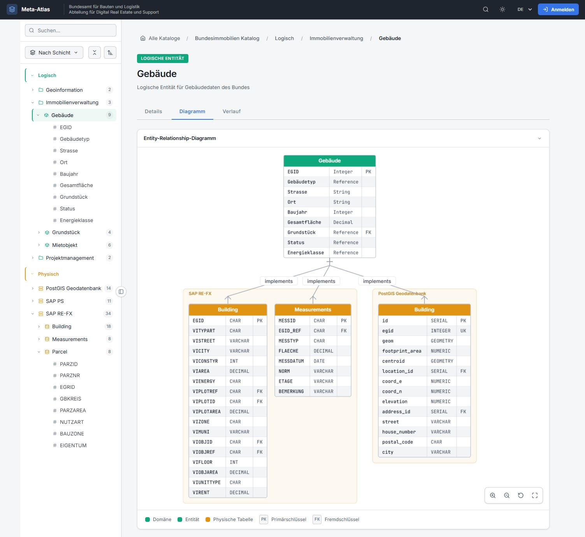
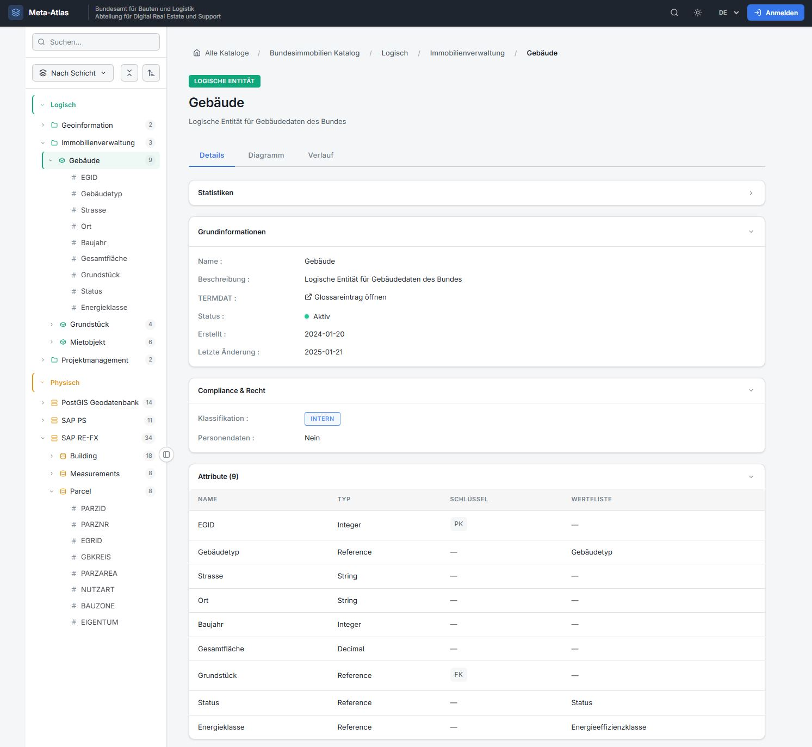

# Meta-Atlas

A metadata catalog prototype for documenting and navigating enterprise data assets across multiple architecture layers.

## Overview

Meta-Atlas provides a unified view of data assets spanning from conceptual business domains down to physical database implementations, following the TOGAF three-layer architecture model:

- **Conceptual Layer** - Business domains, concepts, and definitions
- **Logical Layer** - Data entities, attributes, and relationships
- **Physical Layer** - Systems, database tables, and columns

<p align="center">
  
  
</p>

## Features

- Hierarchical tree navigation with layer switching
- Full-text search across all entities
- Wiki-style documentation views
- Cross-layer traceability mapping
- Multilingual support (DE/EN/FR/IT)
- Dark/light theme
- Responsive design

## Getting Started

No build step required. Simply serve the files with any HTTP server:

```bash
# Using Python
python -m http.server 8000

# Using Node.js
npx serve

# Or use VS Code Live Server extension
```

Then open `http://localhost:8000` in your browser.

## Tech Stack

- Vanilla JavaScript (ES6+)
- CSS3 with custom properties
- JSON data files
- No external dependencies

## License

MIT
