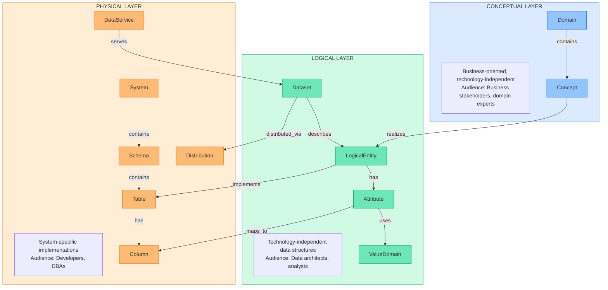

# Metadata Catalog - Database Specification

## 1. Overview

### 1.1 Purpose

This document defines the data model for the Metadata Catalog prototype. The model bridges:

- **TOGAF Data Architecture** layers (Conceptual, Logical, Physical)
- **Swiss Federal Standards** (I14Y, DCAT-AP CH, eCH)
- **International Standards** (W3C DCAT 3, Dublin Core, ISO 11179)

### 1.2 Design Principles

1. **Standards-Based**: Align with established metadata standards where possible
2. **Layer Separation**: Clear distinction between conceptual, logical, and physical entities
3. **Cross-Layer Traceability**: Enable navigation and impact analysis across layers
4. **Swiss Context**: Support Swiss federal compliance requirements (DSG, ISG)
5. **Multilingual**: Native support for DE/FR/IT/EN content
6. **Extensible**: Allow for additional metadata without schema changes

### 1.3 Data Storage Strategy

**Prototype Phase**: Static JSON files loaded at runtime
- Simple file-based storage
- No server required
- Easy to version control and edit

**Production Phase**: Supabase (PostgreSQL)
- Relational database with JSON support
- Row-level security
- Real-time subscriptions
- RESTful API auto-generation

---

## 2. Standards Alignment

### 2.1 Standards Overview

| Standard | Scope | Usage in This Model |
|----------|-------|---------------------|
| **TOGAF 9.2** | Enterprise Architecture | Layer structure (C/L/P), governance concepts |
| **W3C DCAT 3** | Data Catalogs | Dataset, Distribution, DataService classes |
| **DCAT-AP CH 2.0** | Swiss Application Profile | Swiss-specific properties, controlled vocabularies |
| **I14Y** | Swiss Federal Interoperability | Concept, Structure, DataElement hierarchy |
| **ISO 11179** | Metadata Registries | Concept definitions, value domains |
| **Dublin Core** | General Metadata | Basic descriptive properties |
| **eCH-0129** | Swiss Building Data | Domain-specific identifiers (EGID, EDID) |

### 2.2 I14Y Information Model Alignment

The I14Y platform (Swiss Federal Interoperability Platform) defines:

```
Catalog
  ├── Dataset (DCAT)
  │     ├── Structure
  │     │     └── DataElement
  │     │           └── Concept
  │     └── Distribution
  ├── DataService (API)
  └── PublicService (CPSV)
```

**Our Model Mapping:**

| I14Y Entity | Our Entity | Layer |
|-------------|------------|-------|
| Catalog | (implicit) | - |
| Dataset | Dataset | Logical/Physical |
| Structure | LogicalEntity | Logical |
| DataElement | Attribute | Logical |
| Concept | Concept | Conceptual |
| Distribution | Distribution | Physical |
| DataService | DataService | Physical |

### 2.3 DCAT 3 Class Alignment

```
dcat:Resource (abstract)
  ├── dcat:Dataset
  │     └── dcat:DatasetSeries
  ├── dcat:DataService
  └── dcat:Catalog

dcat:Distribution (representation of Dataset)
```

**Our Extensions:**

| DCAT Class | Our Extensions |
|------------|----------------|
| dcat:Dataset | Add compliance metadata, Swiss identifiers |
| dcat:DataService | Add endpoint types, authentication info |
| dcat:Distribution | Add Swiss license codes, format details |
| (new) Domain | Business domain grouping |
| (new) Concept | Business concept definition |
| (new) LogicalEntity | Technology-independent data structure |
| (new) System | Physical system container |

### 2.4 Property Namespace Mapping

| Prefix | Namespace | Usage |
|--------|-----------|-------|
| dct | http://purl.org/dc/terms/ | Dublin Core Terms |
| dcat | http://www.w3.org/ns/dcat# | DCAT vocabulary |
| foaf | http://xmlns.com/foaf/0.1/ | Agent descriptions |
| skos | http://www.w3.org/2004/02/skos/core# | Concept schemes |
| vcard | http://www.w3.org/2006/vcard/ns# | Contact information |
| xsd | http://www.w3.org/2001/XMLSchema# | Data types |
| i14y | https://i14y.admin.ch/ns/ | I14Y extensions |
| mdcat | https://example.org/mdcat/ | Our custom namespace |

---

## 3. Conceptual Data Model

### 3.1 Layer Overview



### 3.2 Entity Relationship Diagram

```mermaid
erDiagram
    Domain ||--o{ Concept : contains
    Concept ||--o{ LogicalEntity : "realizes"
    
    Dataset }o--o{ LogicalEntity : describes
    LogicalEntity ||--o{ Attribute : has
    Attribute }o--o| ValueDomain : uses
    LogicalEntity ||--o{ Relationship : has
    
    Dataset ||--o{ Distribution : "distributed_via"
    DataService }o--o{ Dataset : serves
    Distribution }o--o| DataService : "access_via"
    
    System ||--o{ Schema : contains
    System ||--o{ DataService : hosts
    Schema ||--o{ Table : contains
    Table ||--o{ Column : has
    
    LogicalEntity ||--o{ Table : "implements"
    Attribute ||--o{ Column : "maps_to"

    Domain {
        uuid id PK
        jsonb name
        jsonb description
        string abbreviation
        jsonb owner
        uuid parent_id FK
        enum status
    }

    Concept {
        uuid id PK
        uuid domain_id FK
        jsonb name
        jsonb definition
        jsonb synonyms
        jsonb legal_references
        jsonb standard_references
        enum status
    }

    LogicalEntity {
        uuid id PK
        string name
        jsonb description
        array concept_ids
        enum entity_type
        array business_keys
        jsonb compliance
        enum status
    }

    Attribute {
        uuid id PK
        uuid entity_id FK
        string name
        jsonb description
        enum logical_type
        boolean is_nullable
        boolean is_business_key
        uuid value_domain_id FK
    }

    ValueDomain {
        uuid id PK
        string name
        jsonb description
        enum domain_type
        jsonb values
        string external_source
        enum status
    }

    Dataset {
        uuid id PK
        jsonb name
        jsonb description
        jsonb publisher
        enum access_rights
        jsonb license
        date issued
        enum status
    }

    Distribution {
        uuid id PK
        uuid dataset_id FK
        jsonb name
        string access_url
        string download_url
        string media_type
        string format
        enum status
    }

    DataService {
        uuid id PK
        jsonb name
        jsonb description
        enum service_type
        string endpoint_url
        jsonb publisher
        enum access_rights
        enum status
    }

    System {
        uuid id PK
        string name
        jsonb description
        enum system_type
        string vendor
        string product
        enum environment
        enum status
    }

    Schema {
        uuid id PK
        uuid system_id FK
        string name
        jsonb description
        enum status
    }

    Table {
        uuid id PK
        uuid schema_id FK
        string name
        jsonb description
        enum table_type
        array logical_entity_ids
        array primary_key
        enum status
    }

    Column {
        uuid id PK
        uuid table_id FK
        string name
        jsonb description
        string physical_type
        boolean is_nullable
        boolean is_primary_key
        uuid logical_attribute_id FK
    }
```



### 3.3 Data Products View

Data products represent consumable data assets that can be discovered and used by data consumers.


### 3.4 Cross-Layer Traceability


---

## 4. Entity Specifications

### 4.1 Entity Overview by Layer

| Layer | Entity | Description | I14Y Mapping | DCAT Mapping |
|-------|--------|-------------|--------------|--------------|
| **Organization** | Project | Workspace container for metadata | - | dcat:Catalog |
| **Conceptual** | Domain | Business domain grouping | - | dcat:Catalog (partial) |
| **Conceptual** | Concept | Business term definition | Konzept | skos:Concept |
| **Logical** | LogicalEntity | Technology-independent data structure | Struktur | - |
| **Logical** | Attribute | Data element within an entity | Datenelement | - |
| **Logical** | ValueDomain | Permissible values (code list) | Konzept (Codeliste) | skos:ConceptScheme |
| **Logical** | Dataset | Published data collection | Datensatz | dcat:Dataset |
| **Physical** | System | Application or database | - | - |
| **Physical** | Schema | Database namespace | - | - |
| **Physical** | Table | Physical table or view | - | - |
| **Physical** | Column | Physical column | - | - |
| **Physical** | DataService | API endpoint | Elektronische Schnittstelle | dcat:DataService |
| **Physical** | Distribution | Data access point | Distribution | dcat:Distribution |

### 4.2 Organization Layer Entities

#### 4.2.0 Project

A project represents a self-contained workspace or catalog that groups related metadata. Projects provide organizational boundaries for managing metadata across teams, departments, or initiatives. Each project creates isolated copies of all content (domains, concepts, entities, tables) enabling parallel development and versioning.

**Entity: Project**

| Attribute | Type | Required | Description | Standard Mapping |
|-----------|------|----------|-------------|------------------|
| id | UUID | Yes | Unique identifier | dct:identifier |
| name | MultiLang | Yes | Project name in multiple languages | dct:title |
| description | MultiLang | Yes | Detailed project description | dct:description |
| owner | AgentRef | Yes | Responsible organization or team | dct:publisher |
| status | Enum | Yes | active, draft, archived | adms:status |
| color | String | No | Display color for UI (hex code) | - |
| icon | String | No | Icon identifier for UI | - |
| domains | UUID[] | No | Associated domain references | - |
| entities | Integer | No | Count of logical entities | - |
| tables | Integer | No | Count of physical tables | - |
| created | Date | Yes | Creation date | dct:created |
| updated | Date | No | Last update date | dct:modified |
| lastActivity | Date | No | Date of last activity | - |
| metadata | Metadata | Yes | Audit trail (created, updated, version) | - |

**Status Values:**
- `active` - Project is actively maintained
- `draft` - Project is being set up or configured
- `archived` - Project is no longer active but preserved for reference

**Use Cases:**
- Separate metadata by department (HR, Finance, Real Estate)
- Isolate development and production catalogs
- Enable parallel metadata governance initiatives
- Support multi-tenant scenarios

---

### 4.3 Conceptual Layer Entities

#### 4.3.1 Domain

A business domain represents a coherent area of business activity or knowledge.

**Entity: Domain**

| Attribute | Type | Required | Description | Standard Mapping |
|-----------|------|----------|-------------|------------------|
| id | UUID | Yes | Unique identifier | dct:identifier |
| name | MultiLang | Yes | Domain name in multiple languages | dct:title |
| description | MultiLang | Yes | Detailed domain description | dct:description |
| abbreviation | String(10) | No | Short code (e.g., "IMMO", "PROJ") | skos:notation |
| owner | AgentRef | Yes | Responsible organization | dct:publisher |
| steward | PersonRef | No | Data steward contact person | dcat:contactPoint |
| parent_id | UUID | No | Parent domain for hierarchy | skos:broader |
| status | Enum | Yes | active, deprecated, draft | adms:status |
| metadata | Metadata | Yes | Audit trail (created, updated, version) | - |

**Status Values:**
- `active` - Domain is in use
- `draft` - Domain is being defined
- `deprecated` - Domain is no longer recommended

---

#### 4.2.2 Concept

A business concept represents a well-defined business term or notion within a domain.

**Entity: Concept**

| Attribute | Type | Required | Description | Standard Mapping |
|-----------|------|----------|-------------|------------------|
| id | UUID | Yes | Unique identifier | dct:identifier |
| domain_id | UUID | Yes | Parent domain reference | skos:inScheme |
| name | MultiLang | Yes | Concept name (preferred label) | skos:prefLabel |
| definition | MultiLang | Yes | Formal business definition | skos:definition |
| synonyms | MultiLang[] | No | Alternative terms by language | skos:altLabel |
| business_rules | String[] | No | Associated business rules | - |
| legal_references | LegalRef[] | No | Applicable laws and regulations | dct:conformsTo |
| standard_references | StdRef[] | No | Relevant standards (eCH, SIA, ISO) | dct:conformsTo |
| external_identifiers | ExtId[] | No | Standard identifiers (EGID, EGRID) | adms:identifier |
| related_concepts | UUID[] | No | Related concept references | skos:related |
| status | Enum | Yes | active, deprecated, draft | adms:status |
| metadata | Metadata | Yes | Audit trail | - |

**Example - Concept "Gebäude":**
```
name: { de: "Gebäude", fr: "Bâtiment", en: "Building" }
definition: { de: "Ein dauerhaft errichtetes Bauwerk..." }
external_identifiers: [{ name: "EGID", source: "GWR" }]
legal_references: [{ law: "GeoIG", article: "Art. 3" }]
standard_references: [{ standard: "eCH-0129", version: "5.0" }]
```

---

### 4.3 Logical Layer Entities

#### 4.3.1 LogicalEntity

A technology-independent data structure that realizes one or more business concepts.

**Entity: LogicalEntity**

| Attribute | Type | Required | Description | Standard Mapping |
|-----------|------|----------|-------------|------------------|
| id | UUID | Yes | Unique identifier | dct:identifier |
| name | String(100) | Yes | Technical entity name (e.g., "Building") | dct:title |
| description | MultiLang | Yes | Entity purpose and scope | dct:description |
| concept_ids | UUID[] | Yes | Realized business concepts (min 1) | - |
| entity_type | Enum | Yes | master, transaction, reference, lookup | dct:type |
| business_keys | String[] | No | Attributes forming business key | - |
| attributes | Attribute[] | Yes | Entity attributes (embedded) | i14y:dataElement |
| relationships | Relationship[] | No | Relationships to other entities | - |
| compliance | Compliance | No | Classification and compliance info | - |
| quality | QualityInfo | No | Data quality metrics | dqv:hasQualityMeasurement |
| status | Enum | Yes | active, deprecated, draft | adms:status |
| metadata | Metadata | Yes | Audit trail | - |

**Entity Types:**
| Type | Description | Example |
|------|-------------|---------|
| master | Core business entities | Building, Person, Organization |
| transaction | Business events/activities | Contract, Payment, Inspection |
| reference | Lookup/reference data | Country, Currency, Status |
| lookup | Simple code tables | Yes/No, Gender, Priority |

---

#### 4.3.2 Attribute

A data element within a logical entity, describing a single piece of information.

**Entity: Attribute**

| Attribute | Type | Required | Description | Standard Mapping |
|-----------|------|----------|-------------|------------------|
| id | UUID | Yes | Unique identifier | dct:identifier |
| entity_id | UUID | Yes | Parent logical entity | - |
| name | String(100) | Yes | Technical attribute name | dct:title |
| description | MultiLang | Yes | Attribute meaning and usage | dct:description |
| logical_type | Enum | Yes | Data type (see below) | - |
| length | Integer | No | Maximum length (String) | - |
| precision | Integer | No | Total digits (Decimal) | - |
| scale | Integer | No | Decimal places (Decimal) | - |
| is_nullable | Boolean | Yes | Allows null/empty values | - |
| is_business_key | Boolean | Yes | Part of business identifier | - |
| default_value | String | No | Default value expression | - |
| value_domain_id | UUID | No | Reference to code list | i14y:concept |
| derivation_rule | String | No | Calculation/derivation formula | - |
| validation_rules | Rule[] | No | Validation constraints | - |
| status | Enum | Yes | active, deprecated, draft | adms:status |
| metadata | Metadata | Yes | Audit trail | - |

**Logical Types:**
| Type | Description | Example |
|------|-------------|---------|
| String | Text/character data | Name, Address, Code |
| Integer | Whole numbers | Count, Year, EGID |
| Decimal | Numbers with decimals | Area, Amount, Percentage |
| Date | Date without time | BirthDate, ValidFrom |
| DateTime | Date with time | CreatedAt, ModifiedAt |
| Boolean | True/False | IsActive, HasChildren |
| Binary | Binary data | Document, Image |
| Reference | Foreign key reference | StatusCode, CategoryId |

---

#### 4.3.3 ValueDomain (Codeliste)

A set of permissible values for an attribute, also known as a code list or enumeration.

**Entity: ValueDomain**

| Attribute | Type | Required | Description | Standard Mapping |
|-----------|------|----------|-------------|------------------|
| id | UUID | Yes | Unique identifier | dct:identifier |
| name | String(100) | Yes | Value domain name | skos:prefLabel |
| description | MultiLang | Yes | Purpose and usage | skos:definition |
| domain_type | Enum | Yes | enumeration, range, pattern, external | - |
| values | ValueCode[] | Cond. | Code values (for enumeration) | skos:Concept |
| min_value | String | Cond. | Minimum value (for range) | - |
| max_value | String | Cond. | Maximum value (for range) | - |
| pattern | String | Cond. | Regex pattern (for pattern) | - |
| external_source | URL | Cond. | External source URL | dcat:accessURL |
| version | String | No | Version identifier | dcat:version |
| valid_from | Date | No | Validity start date | schema:validFrom |
| valid_to | Date | No | Validity end date | schema:validThrough |
| status | Enum | Yes | active, deprecated, draft | adms:status |
| metadata | Metadata | Yes | Audit trail | - |

**Domain Types:**
| Type | Description | Required Fields |
|------|-------------|-----------------|
| enumeration | Fixed list of codes | values |
| range | Numeric or date range | min_value, max_value |
| pattern | Regex pattern match | pattern |
| external | External code list | external_source |

**ValueCode Structure:**
| Field | Type | Required | Description |
|-------|------|----------|-------------|
| code | String | Yes | Code value |
| name | MultiLang | Yes | Display name |
| description | MultiLang | No | Code description |
| parent_code | String | No | Parent for hierarchies |
| sort_order | Integer | No | Display order |
| valid_from | Date | No | Code validity start |
| valid_to | Date | No | Code validity end |

---

#### 4.3.4 Dataset

A collection of data published or curated by an organization (DCAT-aligned).

**Entity: Dataset**

| Attribute | Type | Required | Description | Standard Mapping |
|-----------|------|----------|-------------|------------------|
| id | UUID | Yes | Unique identifier | dct:identifier |
| name | MultiLang | Yes | Dataset title | dct:title |
| description | MultiLang | Yes | Dataset description | dct:description |
| publisher | AgentRef | Yes | Publishing organization | dct:publisher |
| contact_point | ContactRef | No | Contact information | dcat:contactPoint |
| keywords | MultiLang[] | No | Keywords/tags | dcat:keyword |
| themes | String[] | No | Theme categories | dcat:theme |
| logical_entities | UUID[] | No | Described logical entities | - |
| access_rights | Enum | Yes | public, internal, restricted | dct:accessRights |
| license | LicenseRef | No | Usage license | dct:license |
| spatial_coverage | GeoRef | No | Geographic coverage | dct:spatial |
| temporal_coverage | PeriodRef | No | Time period covered | dct:temporal |
| accrual_periodicity | String | No | Update frequency | dct:accrualPeriodicity |
| issued | Date | No | Publication date | dct:issued |
| modified | DateTime | No | Last modification | dct:modified |
| distributions | UUID[] | No | Available distributions | dcat:distribution |
| compliance | Compliance | No | Compliance metadata | - |
| quality | QualityInfo | No | Quality metrics | dqv:hasQualityMeasurement |
| status | Enum | Yes | active, deprecated, draft | adms:status |
| metadata | Metadata | Yes | Audit trail | - |

**Access Rights:**
| Value | Description |
|-------|-------------|
| public | Open data, publicly accessible |
| internal | Internal use within organization |
| restricted | Restricted access with authorization |

---

### 4.4 Physical Layer Entities

#### 4.4.1 System

A physical system, application, or database that hosts data.

**Entity: System**

| Attribute | Type | Required | Description | Standard Mapping |
|-----------|------|----------|-------------|------------------|
| id | UUID | Yes | Unique identifier | dct:identifier |
| name | String(100) | Yes | System name | dct:title |
| description | MultiLang | Yes | System purpose and scope | dct:description |
| system_type | Enum | Yes | Type of system (see below) | dct:type |
| vendor | String | No | Vendor/manufacturer | - |
| product | String | No | Product name | - |
| version | String | No | Product version | dcat:version |
| environment | Enum | Yes | production, test, development | - |
| owner | AgentRef | Yes | System owner | dct:publisher |
| technical_contact | PersonRef | No | Technical contact | dcat:contactPoint |
| documentation_url | URL | No | Documentation link | foaf:page |
| status | Enum | Yes | active, deprecated, planned, decommissioned | adms:status |
| metadata | Metadata | Yes | Audit trail | - |

**System Types:**
| Type | Description | Example |
|------|-------------|---------|
| database | Relational or NoSQL database | PostgreSQL, Oracle, MongoDB |
| application | Business application | SAP, Salesforce |
| api | API platform | API Gateway, Kong |
| data_warehouse | Analytical data store | Snowflake, BigQuery |
| data_lake | Raw data storage | S3, Azure Data Lake |
| file_system | File-based storage | SharePoint, NAS |

---

#### 4.4.2 Schema

A database schema or namespace within a system.

**Entity: Schema**

| Attribute | Type | Required | Description | Standard Mapping |
|-----------|------|----------|-------------|------------------|
| id | UUID | Yes | Unique identifier | dct:identifier |
| system_id | UUID | Yes | Parent system | - |
| name | String(100) | Yes | Schema name | dct:title |
| description | MultiLang | No | Schema description | dct:description |
| status | Enum | Yes | active, deprecated, draft | adms:status |
| metadata | Metadata | Yes | Audit trail | - |

---

#### 4.4.3 Table

A physical table or view within a database schema.

**Entity: Table**

| Attribute | Type | Required | Description | Standard Mapping |
|-----------|------|----------|-------------|------------------|
| id | UUID | Yes | Unique identifier | dct:identifier |
| schema_id | UUID | Yes | Parent schema | - |
| name | String(100) | Yes | Table name | dct:title |
| description | MultiLang | No | Table description | dct:description |
| table_type | Enum | Yes | table, view, materialized_view | dct:type |
| logical_entity_ids | UUID[] | No | Implemented logical entities | - |
| columns | Column[] | Yes | Table columns (embedded) | - |
| primary_key | String[] | No | Primary key column names | - |
| indexes | Index[] | No | Table indexes | - |
| row_count_estimate | Integer | No | Estimated row count | - |
| size_bytes | Integer | No | Storage size in bytes | dcat:byteSize |
| status | Enum | Yes | active, deprecated, draft | adms:status |
| metadata | Metadata | Yes | Audit trail | - |

---

#### 4.4.4 Column

A physical column within a database table.

**Entity: Column**

| Attribute | Type | Required | Description | Standard Mapping |
|-----------|------|----------|-------------|------------------|
| id | UUID | Yes | Unique identifier | dct:identifier |
| table_id | UUID | Yes | Parent table | - |
| name | String(100) | Yes | Column name | dct:title |
| description | MultiLang | No | Column description | dct:description |
| physical_type | String | Yes | Database type (VARCHAR, INT, etc.) | - |
| is_nullable | Boolean | Yes | Allows NULL values | - |
| is_primary_key | Boolean | Yes | Part of primary key | - |
| is_foreign_key | Boolean | Yes | Is foreign key | - |
| foreign_key_ref | FKRef | No | Foreign key reference details | - |
| default_value | String | No | Default value | - |
| logical_attribute_id | UUID | No | Mapped logical attribute | - |
| position | Integer | Yes | Column ordinal position | - |
| status | Enum | Yes | active, deprecated, draft | adms:status |

---

#### 4.4.5 DataService

An API or service providing programmatic access to data.

**Entity: DataService**

| Attribute | Type | Required | Description | Standard Mapping |
|-----------|------|----------|-------------|------------------|
| id | UUID | Yes | Unique identifier | dct:identifier |
| name | MultiLang | Yes | Service name | dct:title |
| description | MultiLang | Yes | Service description | dct:description |
| service_type | Enum | Yes | API type (see below) | dct:type |
| endpoint_url | URL | Yes | Service endpoint URL | dcat:endpointURL |
| endpoint_description | URL | No | API documentation URL | dcat:endpointDescription |
| serves_datasets | UUID[] | No | Datasets served by this API | dcat:servesDataset |
| system_id | UUID | No | Hosting system | - |
| publisher | AgentRef | Yes | Service publisher | dct:publisher |
| contact_point | ContactRef | No | Contact information | dcat:contactPoint |
| access_rights | Enum | Yes | public, internal, restricted | dct:accessRights |
| authentication | AuthInfo | No | Authentication requirements | - |
| license | LicenseRef | No | Usage license | dct:license |
| conforms_to | String[] | No | API standards (OpenAPI, etc.) | dct:conformsTo |
| keywords | MultiLang[] | No | Keywords/tags | dcat:keyword |
| status | Enum | Yes | active, deprecated, planned | adms:status |
| metadata | Metadata | Yes | Audit trail | - |

**Service Types:**
| Type | Description |
|------|-------------|
| rest | RESTful API |
| soap | SOAP Web Service |
| graphql | GraphQL API |
| odata | OData API |
| sparql | SPARQL Endpoint |
| wfs | OGC Web Feature Service |
| wms | OGC Web Map Service |

---

#### 4.4.6 Distribution

A specific representation or access point for a dataset.

**Entity: Distribution**

| Attribute | Type | Required | Description | Standard Mapping |
|-----------|------|----------|-------------|------------------|
| id | UUID | Yes | Unique identifier | dct:identifier |
| dataset_id | UUID | Yes | Parent dataset | - |
| name | MultiLang | No | Distribution title | dct:title |
| description | MultiLang | No | Distribution description | dct:description |
| access_url | URL | Yes | Access URL (landing page or endpoint) | dcat:accessURL |
| download_url | URL | No | Direct download URL | dcat:downloadURL |
| media_type | String | No | MIME type (e.g., text/csv) | dcat:mediaType |
| format | String | No | File format (e.g., CSV, JSON) | dct:format |
| byte_size | Integer | No | File size in bytes | dcat:byteSize |
| checksum | String | No | File checksum (SHA-256) | spdx:checksum |
| access_service_id | UUID | No | Access via DataService | dcat:accessService |
| license | LicenseRef | No | Distribution-specific license | dct:license |
| rights | String | No | Rights statement | dct:rights |
| issued | Date | No | Publication date | dct:issued |
| modified | DateTime | No | Last modification | dct:modified |
| status | Enum | Yes | active, deprecated | adms:status |
| metadata | Metadata | Yes | Audit trail | - |

---

### 4.5 Supporting Types

#### 4.5.1 Type Definitions

**MultiLang** - Multilingual string with fallback support

```json
{
  "de": "German text (required)",
  "fr": "French text (optional)",
  "it": "Italian text (optional)",
  "en": "English text (optional)"
}
```

**Metadata** - Audit and versioning information

| Field | Type | Description |
|-------|------|-------------|
| created_at | DateTime | Creation timestamp (ISO 8601) |
| created_by | String | Creator identifier |
| updated_at | DateTime | Last update timestamp |
| updated_by | String | Last updater identifier |
| version | Integer | Version number (starts at 1) |

**Compliance** - Classification and compliance information

| Field | Type | Description |
|-------|------|-------------|
| personal_data | Boolean | Contains personal data (DSG) |
| special_categories | Boolean | Special categories (DSG Art. 5) |
| data_subjects | Enum[] | EMPLOYEE, CUSTOMER, CITIZEN, SUPPLIER, OTHER |
| confidentiality | Enum | PUBLIC, INTERNAL, CONFIDENTIAL, SECRET |
| integrity | Enum | LOW, MEDIUM, HIGH, VERY_HIGH |
| availability | Enum | LOW, MEDIUM, HIGH, VERY_HIGH |
| retention_period | String | Retention requirement (e.g., "10 years") |
| legal_basis | LegalRef[] | Processing legal basis |
| processing_purposes | String[] | Purpose descriptions |

**LegalRef** - Reference to a law or regulation

| Field | Type | Description |
|-------|------|-------------|
| law | String | Law identifier (DSG, OR, GeoIG) |
| article | String | Article reference (e.g., "Art. 3") |
| description | MultiLang | Description of relevance |
| url | URL | Link to official text |

**StdRef** - Reference to a standard

| Field | Type | Description |
|-------|------|-------------|
| standard | String | Standard identifier (eCH-0129, SIA 405) |
| version | String | Version number |
| description | MultiLang | Description of relevance |
| url | URL | Link to standard document |

**AgentRef** - Reference to an organization or person

| Field | Type | Description |
|-------|------|-------------|
| id | String | Agent identifier |
| name | String | Agent name |
| type | Enum | organization, person |
| email | String | Contact email |
| url | URL | Agent URL/website |

---

## 5. Cross-Layer Relationships

### 5.1 Mapping Types

| Mapping | From | To | Cardinality | Description |
|---------|------|-----|-------------|-------------|
| realizes | Concept | LogicalEntity | 1:n | Concept realized by entities |
| implements | LogicalEntity | Table | 1:n | Entity implemented by tables |
| maps_to | Attribute | Column | 1:n | Attribute mapped to columns |
| uses | Attribute | ValueDomain | n:1 | Attribute uses value domain |
| describes | Dataset | LogicalEntity | n:n | Dataset describes entities |
| serves | DataService | Dataset | n:n | Service provides dataset access |
| distributes | Distribution | Dataset | n:1 | Distribution of dataset |

### 5.2 Mapping Table Structure

For explicit cross-layer mappings, a separate mapping collection is maintained:

```json
{
  "mappings": [
    {
      "id": "map-001",
      "source_type": "concept",
      "source_id": "c001",
      "target_type": "logical_entity",
      "target_id": "le001",
      "mapping_type": "realizes",
      "confidence": "confirmed",
      "notes": "Primary realization",
      "metadata": { ... }
    }
  ]
}
```

### 5.3 Lineage Information

Data lineage tracks the flow of data through systems:

```json
{
  "lineage": [
    {
      "id": "lin-001",
      "entity_id": "le001",
      "entity_type": "logical_entity",
      "sources": [
        {
          "system": "GWR",
          "type": "external",
          "description": "Gebäude- und Wohnungsregister"
        }
      ],
      "transformations": [
        {
          "name": "daily_sync",
          "type": "etl",
          "schedule": "0 3 * * *",
          "description": "Daily synchronization from GWR"
        }
      ],
      "targets": [
        {
          "system_id": "sys001",
          "table_id": "tbl001"
        }
      ]
    }
  ]
}
```

---

## 6. JSON Schema Definitions

### 6.1 Common Definitions

```json
{
  "$schema": "http://json-schema.org/draft-07/schema#",
  "$id": "https://example.org/mdcat/common.schema.json",
  "definitions": {
    "uuid": {
      "type": "string",
      "pattern": "^[a-z0-9-]+$"
    },
    "multiLang": {
      "type": "object",
      "properties": {
        "de": { "type": "string" },
        "fr": { "type": "string" },
        "it": { "type": "string" },
        "en": { "type": "string" }
      },
      "required": ["de"],
      "additionalProperties": false
    },
    "metadata": {
      "type": "object",
      "properties": {
        "created_at": { "type": "string", "format": "date-time" },
        "created_by": { "type": "string" },
        "updated_at": { "type": "string", "format": "date-time" },
        "updated_by": { "type": "string" },
        "version": { "type": "integer", "minimum": 1 }
      },
      "required": ["created_at", "created_by", "version"]
    },
    "status": {
      "type": "string",
      "enum": ["active", "deprecated", "draft", "planned", "decommissioned"]
    },
    "agentRef": {
      "type": "object",
      "properties": {
        "id": { "type": "string" },
        "name": { "type": "string" },
        "type": { "type": "string", "enum": ["organization", "person"] },
        "email": { "type": "string", "format": "email" },
        "url": { "type": "string", "format": "uri" }
      },
      "required": ["name"]
    },
    "legalRef": {
      "type": "object",
      "properties": {
        "law": { "type": "string" },
        "article": { "type": "string" },
        "description": { "$ref": "#/definitions/multiLang" },
        "url": { "type": "string", "format": "uri" }
      },
      "required": ["law"]
    },
    "compliance": {
      "type": "object",
      "properties": {
        "personal_data": { "type": "boolean" },
        "special_categories": { "type": "boolean" },
        "data_subjects": {
          "type": "array",
          "items": {
            "type": "string",
            "enum": ["EMPLOYEE", "CUSTOMER", "CITIZEN", "SUPPLIER", "OTHER"]
          }
        },
        "confidentiality": {
          "type": "string",
          "enum": ["PUBLIC", "INTERNAL", "CONFIDENTIAL", "SECRET"]
        },
        "integrity": {
          "type": "string",
          "enum": ["LOW", "MEDIUM", "HIGH", "VERY_HIGH"]
        },
        "availability": {
          "type": "string",
          "enum": ["LOW", "MEDIUM", "HIGH", "VERY_HIGH"]
        },
        "retention_period": { "type": "string" },
        "legal_basis": {
          "type": "array",
          "items": { "$ref": "#/definitions/legalRef" }
        }
      }
    }
  }
}
```

### 6.2 Domain Schema

```json
{
  "$schema": "http://json-schema.org/draft-07/schema#",
  "$id": "https://example.org/mdcat/domain.schema.json",
  "type": "object",
  "properties": {
    "id": { "$ref": "common.schema.json#/definitions/uuid" },
    "name": { "$ref": "common.schema.json#/definitions/multiLang" },
    "description": { "$ref": "common.schema.json#/definitions/multiLang" },
    "abbreviation": { "type": "string", "maxLength": 10 },
    "owner": { "$ref": "common.schema.json#/definitions/agentRef" },
    "steward": { "$ref": "common.schema.json#/definitions/agentRef" },
    "parent_id": { "$ref": "common.schema.json#/definitions/uuid" },
    "status": { "$ref": "common.schema.json#/definitions/status" },
    "metadata": { "$ref": "common.schema.json#/definitions/metadata" }
  },
  "required": ["id", "name", "description", "owner", "status", "metadata"]
}
```

### 6.3 Concept Schema

```json
{
  "$schema": "http://json-schema.org/draft-07/schema#",
  "$id": "https://example.org/mdcat/concept.schema.json",
  "type": "object",
  "properties": {
    "id": { "$ref": "common.schema.json#/definitions/uuid" },
    "domain_id": { "$ref": "common.schema.json#/definitions/uuid" },
    "name": { "$ref": "common.schema.json#/definitions/multiLang" },
    "definition": { "$ref": "common.schema.json#/definitions/multiLang" },
    "synonyms": {
      "type": "object",
      "properties": {
        "de": { "type": "array", "items": { "type": "string" } },
        "fr": { "type": "array", "items": { "type": "string" } },
        "it": { "type": "array", "items": { "type": "string" } },
        "en": { "type": "array", "items": { "type": "string" } }
      }
    },
    "business_rules": {
      "type": "array",
      "items": { "type": "string" }
    },
    "legal_references": {
      "type": "array",
      "items": { "$ref": "common.schema.json#/definitions/legalRef" }
    },
    "standard_references": {
      "type": "array",
      "items": {
        "type": "object",
        "properties": {
          "standard": { "type": "string" },
          "version": { "type": "string" },
          "description": { "$ref": "common.schema.json#/definitions/multiLang" },
          "url": { "type": "string", "format": "uri" }
        },
        "required": ["standard"]
      }
    },
    "external_identifiers": {
      "type": "array",
      "items": {
        "type": "object",
        "properties": {
          "name": { "type": "string" },
          "description": { "$ref": "common.schema.json#/definitions/multiLang" },
          "source": { "type": "string" }
        },
        "required": ["name"]
      }
    },
    "related_concepts": {
      "type": "array",
      "items": { "$ref": "common.schema.json#/definitions/uuid" }
    },
    "status": { "$ref": "common.schema.json#/definitions/status" },
    "metadata": { "$ref": "common.schema.json#/definitions/metadata" }
  },
  "required": ["id", "domain_id", "name", "definition", "status", "metadata"]
}
```

### 6.4 LogicalEntity Schema

```json
{
  "$schema": "http://json-schema.org/draft-07/schema#",
  "$id": "https://example.org/mdcat/logical-entity.schema.json",
  "type": "object",
  "properties": {
    "id": { "$ref": "common.schema.json#/definitions/uuid" },
    "name": { "type": "string" },
    "description": { "$ref": "common.schema.json#/definitions/multiLang" },
    "concept_ids": {
      "type": "array",
      "items": { "$ref": "common.schema.json#/definitions/uuid" },
      "minItems": 1
    },
    "entity_type": {
      "type": "string",
      "enum": ["master", "transaction", "reference", "lookup"]
    },
    "business_keys": {
      "type": "array",
      "items": { "type": "string" }
    },
    "attributes": {
      "type": "array",
      "items": { "$ref": "#/definitions/attribute" }
    },
    "relationships": {
      "type": "array",
      "items": { "$ref": "#/definitions/relationship" }
    },
    "compliance": { "$ref": "common.schema.json#/definitions/compliance" },
    "status": { "$ref": "common.schema.json#/definitions/status" },
    "metadata": { "$ref": "common.schema.json#/definitions/metadata" }
  },
  "required": ["id", "name", "description", "concept_ids", "entity_type", "attributes", "status", "metadata"],
  "definitions": {
    "attribute": {
      "type": "object",
      "properties": {
        "id": { "$ref": "common.schema.json#/definitions/uuid" },
        "name": { "type": "string" },
        "description": { "$ref": "common.schema.json#/definitions/multiLang" },
        "logical_type": {
          "type": "string",
          "enum": ["String", "Integer", "Decimal", "Date", "DateTime", "Boolean", "Binary", "Reference"]
        },
        "length": { "type": "integer", "minimum": 1 },
        "precision": { "type": "integer", "minimum": 1 },
        "scale": { "type": "integer", "minimum": 0 },
        "is_nullable": { "type": "boolean" },
        "is_business_key": { "type": "boolean" },
        "default_value": { "type": "string" },
        "value_domain_id": { "$ref": "common.schema.json#/definitions/uuid" }
      },
      "required": ["id", "name", "description", "logical_type", "is_nullable", "is_business_key"]
    },
    "relationship": {
      "type": "object",
      "properties": {
        "name": { "type": "string" },
        "target_entity_id": { "$ref": "common.schema.json#/definitions/uuid" },
        "cardinality": {
          "type": "string",
          "enum": ["1:1", "1:n", "n:1", "n:m"]
        },
        "description": { "$ref": "common.schema.json#/definitions/multiLang" }
      },
      "required": ["name", "target_entity_id", "cardinality"]
    }
  }
}
```

---

## 7. Sample Data (BBL Context)

### 7.1 domains.json

```json
{
  "domains": [
    {
      "id": "dom-immo",
      "name": {
        "de": "Immobilienverwaltung",
        "fr": "Gestion immobilière",
        "it": "Gestione immobiliare",
        "en": "Real Estate Management"
      },
      "description": {
        "de": "Verwaltung des Immobilienportfolios des Bundes, einschliesslich Gebäude, Grundstücke und Mietobjekte.",
        "fr": "Gestion du portefeuille immobilier de la Confédération, y compris les bâtiments, les terrains et les objets loués.",
        "en": "Management of the federal real estate portfolio, including buildings, plots, and rental objects."
      },
      "abbreviation": "IMMO",
      "owner": {
        "name": "Bundesamt für Bauten und Logistik",
        "type": "organization",
        "email": "info@bbl.admin.ch",
        "url": "https://www.bbl.admin.ch"
      },
      "steward": {
        "name": "Abteilung Immobilienmanagement",
        "type": "organization"
      },
      "status": "active",
      "metadata": {
        "created_at": "2024-01-15T10:00:00Z",
        "created_by": "system",
        "updated_at": "2024-10-08T14:30:00Z",
        "updated_by": "davidrasner5",
        "version": 2
      }
    },
    {
      "id": "dom-projekt",
      "name": {
        "de": "Projektmanagement",
        "fr": "Gestion de projet",
        "en": "Project Management"
      },
      "description": {
        "de": "Planung und Durchführung von Bau- und Sanierungsprojekten.",
        "en": "Planning and execution of construction and renovation projects."
      },
      "abbreviation": "PROJ",
      "owner": {
        "name": "Bundesamt für Bauten und Logistik",
        "type": "organization"
      },
      "status": "active",
      "metadata": {
        "created_at": "2024-01-15T10:00:00Z",
        "created_by": "system",
        "version": 1
      }
    }
  ]
}
```

### 7.2 concepts.json

```json
{
  "concepts": [
    {
      "id": "con-gebaeude",
      "domain_id": "dom-immo",
      "name": {
        "de": "Gebäude",
        "fr": "Bâtiment",
        "it": "Edificio",
        "en": "Building"
      },
      "definition": {
        "de": "Ein dauerhaft errichtetes Bauwerk mit Dach und Wänden, das zum Wohnen, Arbeiten oder für andere Zwecke genutzt wird. Ein Gebäude ist durch einen Eidgenössischen Gebäudeidentifikator (EGID) eindeutig identifiziert.",
        "fr": "Une construction permanente avec toit et murs, utilisée pour l'habitation, le travail ou d'autres fins. Un bâtiment est identifié de manière unique par un identifiant fédéral de bâtiment (EGID).",
        "en": "A permanently constructed structure with roof and walls, used for living, working, or other purposes. A building is uniquely identified by a Federal Building Identifier (EGID)."
      },
      "synonyms": {
        "de": ["Bauwerk", "Liegenschaft", "Immobilie"],
        "fr": ["Édifice", "Immeuble", "Construction"],
        "en": ["Structure", "Property", "Edifice"]
      },
      "business_rules": [
        "Jedes Gebäude muss einen gültigen EGID haben",
        "Ein Gebäude gehört zu genau einem Grundstück",
        "Der Gebäudestatus muss aus der Codeliste 'Gebäudestatus' stammen"
      ],
      "legal_references": [
        {
          "law": "GeoIG",
          "article": "Art. 3",
          "description": {
            "de": "Geobasisdaten des Bundesrechts"
          },
          "url": "https://www.fedlex.admin.ch/eli/cc/2008/388/de"
        },
        {
          "law": "GWR-Verordnung",
          "article": "Art. 6",
          "description": {
            "de": "Eidgenössischer Gebäudeidentifikator"
          }
        }
      ],
      "standard_references": [
        {
          "standard": "eCH-0129",
          "version": "5.0",
          "description": {
            "de": "Datenstandard Gebäudeadressen"
          },
          "url": "https://www.ech.ch/de/ech/ech-0129"
        },
        {
          "standard": "SIA 405",
          "description": {
            "de": "Geodaten zu Ver- und Entsorgungsleitungen"
          }
        }
      ],
      "external_identifiers": [
        {
          "name": "EGID",
          "description": {
            "de": "Eidgenössischer Gebäudeidentifikator",
            "fr": "Identificateur fédéral de bâtiment"
          },
          "source": "GWR"
        }
      ],
      "related_concepts": ["con-grundstueck", "con-adresse", "con-mietobjekt"],
      "status": "active",
      "metadata": {
        "created_at": "2024-01-15T10:00:00Z",
        "created_by": "system",
        "updated_at": "2024-10-08T14:30:00Z",
        "updated_by": "davidrasner5",
        "version": 3
      }
    },
    {
      "id": "con-grundstueck",
      "domain_id": "dom-immo",
      "name": {
        "de": "Grundstück",
        "fr": "Bien-fonds",
        "en": "Plot"
      },
      "definition": {
        "de": "Eine räumlich abgegrenzte Fläche, die im Grundbuch als selbständige Einheit eingetragen ist.",
        "en": "A spatially delimited area registered as an independent unit in the land register."
      },
      "external_identifiers": [
        {
          "name": "EGRID",
          "description": {
            "de": "Eidgenössischer Grundstücksidentifikator"
          },
          "source": "Grundbuch"
        }
      ],
      "related_concepts": ["con-gebaeude"],
      "status": "active",
      "metadata": {
        "created_at": "2024-01-15T10:00:00Z",
        "created_by": "system",
        "version": 1
      }
    },
    {
      "id": "con-mietobjekt",
      "domain_id": "dom-immo",
      "name": {
        "de": "Mietobjekt",
        "fr": "Objet loué",
        "en": "Rental Unit"
      },
      "definition": {
        "de": "Eine vermietbare Einheit innerhalb eines Gebäudes, z.B. eine Wohnung, ein Büro oder eine Gewerbefläche.",
        "en": "A rentable unit within a building, such as an apartment, office, or commercial space."
      },
      "synonyms": {
        "de": ["Mieteinheit", "Nutzungseinheit"],
        "en": ["Rental Object", "Tenancy Unit"]
      },
      "legal_references": [
        {
          "law": "OR",
          "article": "Art. 253ff",
          "description": {
            "de": "Mietrecht"
          }
        }
      ],
      "related_concepts": ["con-gebaeude", "con-mietvertrag"],
      "status": "active",
      "metadata": {
        "created_at": "2024-01-15T10:00:00Z",
        "created_by": "system",
        "version": 1
      }
    },
    {
      "id": "con-mietvertrag",
      "domain_id": "dom-immo",
      "name": {
        "de": "Mietvertrag",
        "fr": "Contrat de bail",
        "en": "Lease Agreement"
      },
      "definition": {
        "de": "Ein Vertrag, durch den sich der Vermieter verpflichtet, dem Mieter eine Sache zum Gebrauch zu überlassen, und der Mieter, dafür einen Mietzins zu zahlen.",
        "en": "A contract by which the lessor agrees to grant the lessee the use of property, and the lessee agrees to pay rent."
      },
      "legal_references": [
        {
          "law": "OR",
          "article": "Art. 253",
          "description": {
            "de": "Begriff des Mietvertrags"
          }
        }
      ],
      "related_concepts": ["con-mietobjekt"],
      "status": "active",
      "metadata": {
        "created_at": "2024-01-15T10:00:00Z",
        "created_by": "system",
        "version": 1
      }
    }
  ]
}
```

### 7.3 logical-entities.json

```json
{
  "logical_entities": [
    {
      "id": "le-building",
      "name": "Building",
      "description": {
        "de": "Logische Entität für Gebäudedaten des Bundes",
        "en": "Logical entity for federal building data"
      },
      "concept_ids": ["con-gebaeude"],
      "entity_type": "master",
      "business_keys": ["egid"],
      "attributes": [
        {
          "id": "attr-building-egid",
          "name": "egid",
          "description": {
            "de": "Eidgenössischer Gebäudeidentifikator",
            "fr": "Identificateur fédéral de bâtiment"
          },
          "logical_type": "Integer",
          "is_nullable": false,
          "is_business_key": true
        },
        {
          "id": "attr-building-status",
          "name": "building_status",
          "description": {
            "de": "Status des Gebäudes (projektiert, im Bau, bestehend, abgebrochen)"
          },
          "logical_type": "Reference",
          "is_nullable": false,
          "is_business_key": false,
          "value_domain_id": "vd-building-status"
        },
        {
          "id": "attr-building-category",
          "name": "building_category",
          "description": {
            "de": "Gebäudekategorie nach GWR"
          },
          "logical_type": "Reference",
          "is_nullable": false,
          "is_business_key": false,
          "value_domain_id": "vd-building-category"
        },
        {
          "id": "attr-building-class",
          "name": "building_class",
          "description": {
            "de": "Gebäudeklasse nach GWR"
          },
          "logical_type": "Reference",
          "is_nullable": true,
          "is_business_key": false,
          "value_domain_id": "vd-building-class"
        },
        {
          "id": "attr-building-construction-year",
          "name": "construction_year",
          "description": {
            "de": "Baujahr des Gebäudes"
          },
          "logical_type": "Integer",
          "is_nullable": true,
          "is_business_key": false
        },
        {
          "id": "attr-building-renovation-year",
          "name": "last_renovation_year",
          "description": {
            "de": "Jahr der letzten Renovation"
          },
          "logical_type": "Integer",
          "is_nullable": true,
          "is_business_key": false
        },
        {
          "id": "attr-building-floors",
          "name": "floor_count",
          "description": {
            "de": "Anzahl Stockwerke"
          },
          "logical_type": "Integer",
          "is_nullable": true,
          "is_business_key": false
        },
        {
          "id": "attr-building-area",
          "name": "gross_floor_area",
          "description": {
            "de": "Bruttogeschossfläche in m²"
          },
          "logical_type": "Decimal",
          "precision": 12,
          "scale": 2,
          "is_nullable": true,
          "is_business_key": false
        },
        {
          "id": "attr-building-volume",
          "name": "building_volume",
          "description": {
            "de": "Gebäudevolumen in m³"
          },
          "logical_type": "Decimal",
          "precision": 12,
          "scale": 2,
          "is_nullable": true,
          "is_business_key": false
        },
        {
          "id": "attr-building-energy-rating",
          "name": "energy_rating",
          "description": {
            "de": "Energieeffizienzklasse (GEAK)"
          },
          "logical_type": "Reference",
          "is_nullable": true,
          "is_business_key": false,
          "value_domain_id": "vd-energy-rating"
        },
        {
          "id": "attr-building-plot",
          "name": "plot_id",
          "description": {
            "de": "Referenz zum Grundstück"
          },
          "logical_type": "Reference",
          "is_nullable": false,
          "is_business_key": false
        }
      ],
      "relationships": [
        {
          "name": "located_on",
          "target_entity_id": "le-plot",
          "cardinality": "n:1",
          "description": {
            "de": "Gebäude befindet sich auf Grundstück"
          }
        },
        {
          "name": "contains",
          "target_entity_id": "le-rental-unit",
          "cardinality": "1:n",
          "description": {
            "de": "Gebäude enthält Mietobjekte"
          }
        }
      ],
      "compliance": {
        "personal_data": false,
        "confidentiality": "INTERNAL",
        "integrity": "HIGH",
        "availability": "MEDIUM"
      },
      "status": "active",
      "metadata": {
        "created_at": "2024-01-15T10:00:00Z",
        "created_by": "system",
        "updated_at": "2024-10-08T14:30:00Z",
        "updated_by": "davidrasner5",
        "version": 2
      }
    }
  ]
}
```

### 7.4 value-domains.json

```json
{
  "value_domains": [
    {
      "id": "vd-building-status",
      "name": "BuildingStatus",
      "description": {
        "de": "Gebäudestatus gemäss GWR",
        "fr": "Statut du bâtiment selon RegBL"
      },
      "domain_type": "enumeration",
      "values": [
        {
          "code": "1001",
          "name": {
            "de": "projektiert",
            "fr": "projeté"
          },
          "sort_order": 1
        },
        {
          "code": "1002",
          "name": {
            "de": "bewilligt",
            "fr": "autorisé"
          },
          "sort_order": 2
        },
        {
          "code": "1003",
          "name": {
            "de": "im Bau",
            "fr": "en construction"
          },
          "sort_order": 3
        },
        {
          "code": "1004",
          "name": {
            "de": "bestehend",
            "fr": "existant"
          },
          "sort_order": 4
        },
        {
          "code": "1005",
          "name": {
            "de": "nicht nutzbar",
            "fr": "inutilisable"
          },
          "sort_order": 5
        },
        {
          "code": "1007",
          "name": {
            "de": "abgebrochen",
            "fr": "démoli"
          },
          "sort_order": 6
        },
        {
          "code": "1008",
          "name": {
            "de": "nicht realisiert",
            "fr": "non réalisé"
          },
          "sort_order": 7
        }
      ],
      "external_source": "https://www.housing-stat.ch/de/help/42.html",
      "status": "active",
      "metadata": {
        "created_at": "2024-01-15T10:00:00Z",
        "created_by": "system",
        "version": 1
      }
    },
    {
      "id": "vd-building-category",
      "name": "BuildingCategory",
      "description": {
        "de": "Gebäudekategorie gemäss GWR"
      },
      "domain_type": "enumeration",
      "values": [
        {
          "code": "1010",
          "name": { "de": "Provisorische Unterkunft" },
          "sort_order": 1
        },
        {
          "code": "1020",
          "name": { "de": "Gebäude mit ausschliesslicher Wohnnutzung" },
          "sort_order": 2
        },
        {
          "code": "1030",
          "name": { "de": "Gebäude mit teilweiser Wohnnutzung" },
          "sort_order": 3
        },
        {
          "code": "1040",
          "name": { "de": "Gebäude ohne Wohnnutzung" },
          "sort_order": 4
        },
        {
          "code": "1060",
          "name": { "de": "Sonderbau" },
          "sort_order": 5
        }
      ],
      "status": "active",
      "metadata": {
        "created_at": "2024-01-15T10:00:00Z",
        "created_by": "system",
        "version": 1
      }
    },
    {
      "id": "vd-energy-rating",
      "name": "EnergyRating",
      "description": {
        "de": "Energieeffizienzklasse nach GEAK"
      },
      "domain_type": "enumeration",
      "values": [
        { "code": "A", "name": { "de": "A - Sehr effizient" }, "sort_order": 1 },
        { "code": "B", "name": { "de": "B" }, "sort_order": 2 },
        { "code": "C", "name": { "de": "C" }, "sort_order": 3 },
        { "code": "D", "name": { "de": "D" }, "sort_order": 4 },
        { "code": "E", "name": { "de": "E" }, "sort_order": 5 },
        { "code": "F", "name": { "de": "F" }, "sort_order": 6 },
        { "code": "G", "name": { "de": "G - Wenig effizient" }, "sort_order": 7 }
      ],
      "external_source": "https://www.geak.ch",
      "status": "active",
      "metadata": {
        "created_at": "2024-01-15T10:00:00Z",
        "created_by": "system",
        "version": 1
      }
    }
  ]
}
```

### 7.5 systems.json

```json
{
  "systems": [
    {
      "id": "sys-sap-refx",
      "name": "SAP RE-FX",
      "description": {
        "de": "SAP Real Estate Flexible - System für die Immobilienverwaltung des Bundes",
        "en": "SAP Real Estate Flexible - Federal real estate management system"
      },
      "system_type": "application",
      "vendor": "SAP",
      "product": "SAP RE-FX",
      "version": "S/4HANA 2023",
      "environment": "production",
      "owner": {
        "name": "BBL",
        "type": "organization"
      },
      "technical_contact": {
        "name": "SAP Competence Center",
        "type": "organization",
        "email": "sap-cc@bbl.admin.ch"
      },
      "documentation_url": "https://wiki.bbl.admin.ch/sap-refx",
      "status": "active",
      "metadata": {
        "created_at": "2024-01-15T10:00:00Z",
        "created_by": "system",
        "version": 1
      }
    },
    {
      "id": "sys-postgis",
      "name": "PostGIS Geodatenbank",
      "description": {
        "de": "PostgreSQL/PostGIS Datenbank für Geodaten",
        "en": "PostgreSQL/PostGIS database for geodata"
      },
      "system_type": "database",
      "vendor": "PostgreSQL",
      "product": "PostgreSQL + PostGIS",
      "version": "15.4 / 3.4",
      "environment": "production",
      "owner": {
        "name": "BBL GIS Team",
        "type": "organization"
      },
      "status": "active",
      "metadata": {
        "created_at": "2024-01-15T10:00:00Z",
        "created_by": "system",
        "version": 1
      }
    }
  ]
}
```

### 7.6 tables.json (excerpt)

```json
{
  "schemas": [
    {
      "id": "sch-refx",
      "system_id": "sys-sap-refx",
      "name": "REFX",
      "description": {
        "de": "SAP RE-FX Schema"
      },
      "status": "active",
      "metadata": {
        "created_at": "2024-01-15T10:00:00Z",
        "created_by": "system",
        "version": 1
      }
    }
  ],
  "tables": [
    {
      "id": "tbl-vibdbe",
      "schema_id": "sch-refx",
      "name": "VIBDBE",
      "description": {
        "de": "Gebäude - Real Estate Building Entity"
      },
      "table_type": "table",
      "logical_entity_ids": ["le-building"],
      "columns": [
        {
          "id": "col-vibdbe-intression",
          "name": "INTRESSION",
          "description": { "de": "Interner Schlüssel" },
          "physical_type": "CHAR(20)",
          "is_nullable": false,
          "is_primary_key": true,
          "is_foreign_key": false,
          "position": 1
        },
        {
          "id": "col-vibdbe-egid",
          "name": "EGID",
          "description": { "de": "Eidgenössischer Gebäudeidentifikator" },
          "physical_type": "INT",
          "is_nullable": true,
          "is_primary_key": false,
          "is_foreign_key": false,
          "logical_attribute_id": "attr-building-egid",
          "position": 2
        },
        {
          "id": "col-vibdbe-status",
          "name": "ZSTATUS",
          "description": { "de": "Gebäudestatus" },
          "physical_type": "CHAR(4)",
          "is_nullable": false,
          "is_primary_key": false,
          "is_foreign_key": false,
          "logical_attribute_id": "attr-building-status",
          "position": 3
        },
        {
          "id": "col-vibdbe-baujahr",
          "name": "BAUJAHR",
          "description": { "de": "Baujahr" },
          "physical_type": "INT",
          "is_nullable": true,
          "is_primary_key": false,
          "is_foreign_key": false,
          "logical_attribute_id": "attr-building-construction-year",
          "position": 4
        }
      ],
      "primary_key": ["INTRESSION"],
      "row_count_estimate": 25000,
      "status": "active",
      "metadata": {
        "created_at": "2024-01-15T10:00:00Z",
        "created_by": "system",
        "version": 1
      }
    }
  ]
}
```

---

## 8. Supabase Migration Guide

### 8.1 Database Schema

When migrating to Supabase, the JSON files will be converted to PostgreSQL tables:

```sql
-- Enable UUID extension
CREATE EXTENSION IF NOT EXISTS "uuid-ossp";

-- Domains table
CREATE TABLE domains (
  id UUID PRIMARY KEY DEFAULT uuid_generate_v4(),
  name JSONB NOT NULL,
  description JSONB NOT NULL,
  abbreviation VARCHAR(10),
  owner JSONB NOT NULL,
  steward JSONB,
  parent_id UUID REFERENCES domains(id),
  status VARCHAR(20) NOT NULL DEFAULT 'draft',
  created_at TIMESTAMPTZ NOT NULL DEFAULT NOW(),
  created_by VARCHAR(100) NOT NULL,
  updated_at TIMESTAMPTZ,
  updated_by VARCHAR(100),
  version INTEGER NOT NULL DEFAULT 1
);

-- Concepts table
CREATE TABLE concepts (
  id UUID PRIMARY KEY DEFAULT uuid_generate_v4(),
  domain_id UUID NOT NULL REFERENCES domains(id),
  name JSONB NOT NULL,
  definition JSONB NOT NULL,
  synonyms JSONB,
  business_rules TEXT[],
  legal_references JSONB,
  standard_references JSONB,
  external_identifiers JSONB,
  related_concepts UUID[],
  status VARCHAR(20) NOT NULL DEFAULT 'draft',
  created_at TIMESTAMPTZ NOT NULL DEFAULT NOW(),
  created_by VARCHAR(100) NOT NULL,
  updated_at TIMESTAMPTZ,
  updated_by VARCHAR(100),
  version INTEGER NOT NULL DEFAULT 1
);

-- Logical Entities table
CREATE TABLE logical_entities (
  id UUID PRIMARY KEY DEFAULT uuid_generate_v4(),
  name VARCHAR(100) NOT NULL,
  description JSONB NOT NULL,
  concept_ids UUID[] NOT NULL,
  entity_type VARCHAR(20) NOT NULL,
  business_keys VARCHAR(100)[],
  compliance JSONB,
  status VARCHAR(20) NOT NULL DEFAULT 'draft',
  created_at TIMESTAMPTZ NOT NULL DEFAULT NOW(),
  created_by VARCHAR(100) NOT NULL,
  updated_at TIMESTAMPTZ,
  updated_by VARCHAR(100),
  version INTEGER NOT NULL DEFAULT 1
);

-- Attributes table (separate for better querying)
CREATE TABLE attributes (
  id UUID PRIMARY KEY DEFAULT uuid_generate_v4(),
  entity_id UUID NOT NULL REFERENCES logical_entities(id) ON DELETE CASCADE,
  name VARCHAR(100) NOT NULL,
  description JSONB NOT NULL,
  logical_type VARCHAR(20) NOT NULL,
  length INTEGER,
  precision INTEGER,
  scale INTEGER,
  is_nullable BOOLEAN NOT NULL DEFAULT true,
  is_business_key BOOLEAN NOT NULL DEFAULT false,
  default_value TEXT,
  value_domain_id UUID,
  derivation_rule TEXT,
  position INTEGER NOT NULL,
  status VARCHAR(20) NOT NULL DEFAULT 'active'
);

-- Value Domains table
CREATE TABLE value_domains (
  id UUID PRIMARY KEY DEFAULT uuid_generate_v4(),
  name VARCHAR(100) NOT NULL,
  description JSONB NOT NULL,
  domain_type VARCHAR(20) NOT NULL,
  values JSONB,
  min_value TEXT,
  max_value TEXT,
  pattern TEXT,
  external_source TEXT,
  version VARCHAR(20),
  valid_from DATE,
  valid_to DATE,
  status VARCHAR(20) NOT NULL DEFAULT 'draft',
  created_at TIMESTAMPTZ NOT NULL DEFAULT NOW(),
  created_by VARCHAR(100) NOT NULL,
  version_num INTEGER NOT NULL DEFAULT 1
);

-- Systems table
CREATE TABLE systems (
  id UUID PRIMARY KEY DEFAULT uuid_generate_v4(),
  name VARCHAR(100) NOT NULL,
  description JSONB NOT NULL,
  system_type VARCHAR(20) NOT NULL,
  vendor VARCHAR(100),
  product VARCHAR(100),
  version VARCHAR(50),
  environment VARCHAR(20) NOT NULL,
  owner JSONB NOT NULL,
  technical_contact JSONB,
  documentation_url TEXT,
  status VARCHAR(20) NOT NULL DEFAULT 'draft',
  created_at TIMESTAMPTZ NOT NULL DEFAULT NOW(),
  created_by VARCHAR(100) NOT NULL,
  updated_at TIMESTAMPTZ,
  updated_by VARCHAR(100),
  version_num INTEGER NOT NULL DEFAULT 1
);

-- Schemas table
CREATE TABLE schemas (
  id UUID PRIMARY KEY DEFAULT uuid_generate_v4(),
  system_id UUID NOT NULL REFERENCES systems(id) ON DELETE CASCADE,
  name VARCHAR(100) NOT NULL,
  description JSONB,
  status VARCHAR(20) NOT NULL DEFAULT 'active',
  created_at TIMESTAMPTZ NOT NULL DEFAULT NOW(),
  created_by VARCHAR(100) NOT NULL
);

-- Tables table
CREATE TABLE tables (
  id UUID PRIMARY KEY DEFAULT uuid_generate_v4(),
  schema_id UUID NOT NULL REFERENCES schemas(id) ON DELETE CASCADE,
  name VARCHAR(100) NOT NULL,
  description JSONB,
  table_type VARCHAR(20) NOT NULL,
  logical_entity_ids UUID[],
  primary_key VARCHAR(100)[],
  row_count_estimate BIGINT,
  size_bytes BIGINT,
  status VARCHAR(20) NOT NULL DEFAULT 'active',
  created_at TIMESTAMPTZ NOT NULL DEFAULT NOW(),
  created_by VARCHAR(100) NOT NULL,
  updated_at TIMESTAMPTZ,
  updated_by VARCHAR(100),
  version_num INTEGER NOT NULL DEFAULT 1
);

-- Columns table
CREATE TABLE columns (
  id UUID PRIMARY KEY DEFAULT uuid_generate_v4(),
  table_id UUID NOT NULL REFERENCES tables(id) ON DELETE CASCADE,
  name VARCHAR(100) NOT NULL,
  description JSONB,
  physical_type VARCHAR(100) NOT NULL,
  is_nullable BOOLEAN NOT NULL DEFAULT true,
  is_primary_key BOOLEAN NOT NULL DEFAULT false,
  is_foreign_key BOOLEAN NOT NULL DEFAULT false,
  foreign_key_ref JSONB,
  default_value TEXT,
  logical_attribute_id UUID REFERENCES attributes(id),
  position INTEGER NOT NULL,
  status VARCHAR(20) NOT NULL DEFAULT 'active'
);

-- Cross-layer mappings table
CREATE TABLE mappings (
  id UUID PRIMARY KEY DEFAULT uuid_generate_v4(),
  source_type VARCHAR(50) NOT NULL,
  source_id UUID NOT NULL,
  target_type VARCHAR(50) NOT NULL,
  target_id UUID NOT NULL,
  mapping_type VARCHAR(50) NOT NULL,
  confidence VARCHAR(20) DEFAULT 'confirmed',
  notes TEXT,
  created_at TIMESTAMPTZ NOT NULL DEFAULT NOW(),
  created_by VARCHAR(100) NOT NULL
);

-- Indexes for common queries
CREATE INDEX idx_concepts_domain ON concepts(domain_id);
CREATE INDEX idx_attributes_entity ON attributes(entity_id);
CREATE INDEX idx_tables_schema ON tables(schema_id);
CREATE INDEX idx_columns_table ON columns(table_id);
CREATE INDEX idx_mappings_source ON mappings(source_type, source_id);
CREATE INDEX idx_mappings_target ON mappings(target_type, target_id);

-- Full-text search indexes
CREATE INDEX idx_domains_name_gin ON domains USING GIN (name jsonb_path_ops);
CREATE INDEX idx_concepts_name_gin ON concepts USING GIN (name jsonb_path_ops);
CREATE INDEX idx_concepts_definition_gin ON concepts USING GIN (definition jsonb_path_ops);
```

### 8.2 Row Level Security

```sql
-- Enable RLS
ALTER TABLE domains ENABLE ROW LEVEL SECURITY;
ALTER TABLE concepts ENABLE ROW LEVEL SECURITY;
-- ... repeat for all tables

-- Example policies (adjust based on requirements)
CREATE POLICY "Public read access" ON domains
  FOR SELECT USING (status = 'active');

CREATE POLICY "Authenticated users can insert" ON domains
  FOR INSERT WITH CHECK (auth.role() = 'authenticated');

CREATE POLICY "Owners can update" ON domains
  FOR UPDATE USING (
    owner->>'email' = auth.jwt()->>'email'
  );
```

### 8.3 Migration Script

A migration script will be provided to:
1. Read JSON files
2. Validate data against schemas
3. Insert into Supabase tables
4. Generate mapping records
5. Verify integrity

---

## 9. References

### 9.1 Related Documents

- **REQUIREMENTS.md** - Functional and non-functional requirements
- **DESIGNGUIDE.md** - Visual design system, colors, typography, icons

### 9.2 Standards

- [W3C DCAT 3](https://www.w3.org/TR/vocab-dcat-3/) - Data Catalog Vocabulary
- [DCAT-AP CH 2.0](https://www.dcat-ap.ch/) - Swiss Application Profile
- [I14Y Handbook](https://i14y-ch.github.io/handbook/de/) - Swiss Interoperability Platform
- [Dublin Core](https://www.dublincore.org/) - Metadata Terms
- [ISO 11179](https://www.iso.org/standard/78914.html) - Metadata Registries
- [TOGAF 9.2](https://www.opengroup.org/togaf) - Enterprise Architecture

### 9.3 Swiss Federal Standards

- [eCH-0129](https://www.ech.ch/de/ech/ech-0129) - Datenstandard Gebäudeadressen
- [eCH-0130](https://www.ech.ch/de/ech/ech-0130) - Datenstandard Unternehmensidentifikation
- [GWR](https://www.housing-stat.ch/) - Gebäude- und Wohnungsregister

---

*Document Version: 1.0*
*Created: January 2026*
*Status: Draft for Prototype Development*
