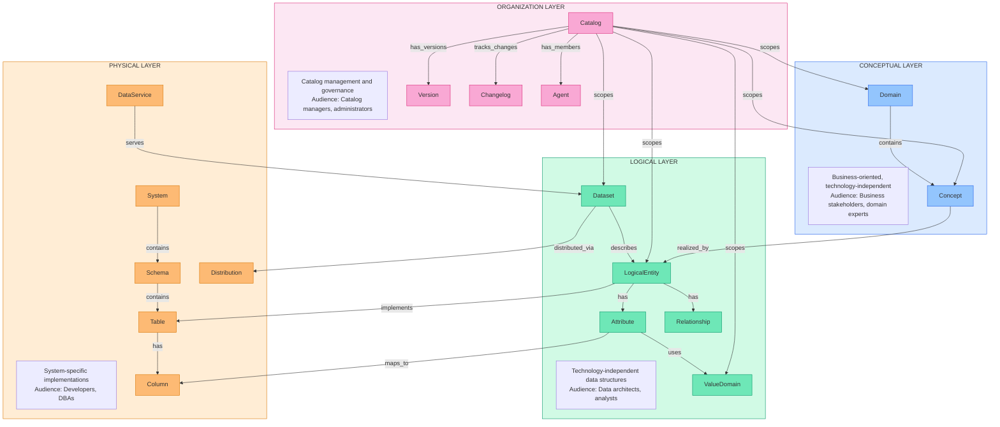
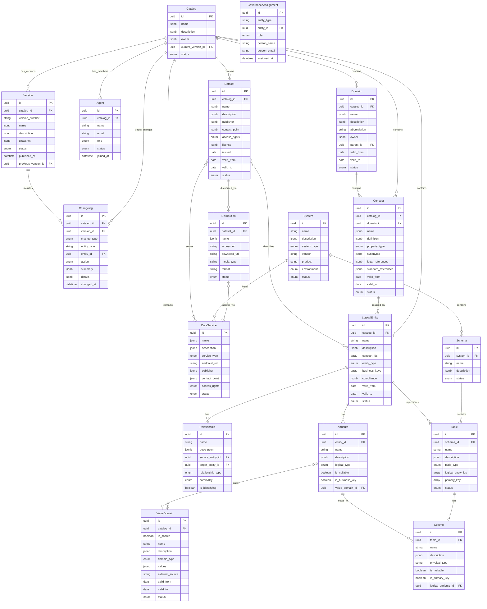
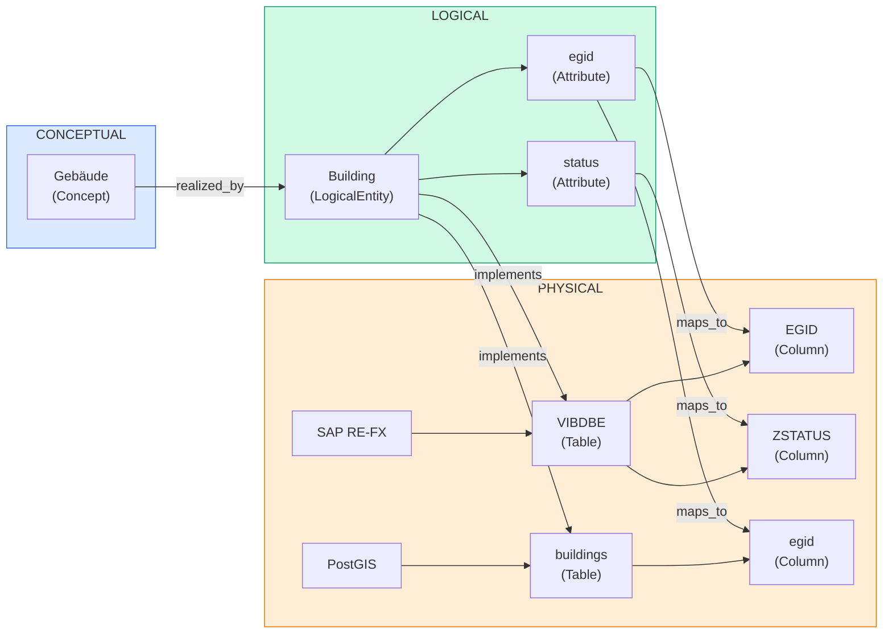

# Metadata Catalog - Data Model Specification

## 1. Overview

### 1.1 Principles

| Principle | Description |
|-----------|-------------|
| **Interoperability** | Align with Swiss (eCH, I14Y) and international (DCAT, ISO) standards for seamless data exchange |
| **Reusability** | Define once, use everywhere — Concepts, ValueDomains, and entities shareable across catalogs |
| **API First** | Design for programmatic access; all data accessible via REST/GraphQL APIs |
| **Open by Default** | Public metadata unless classified; support opendata.swiss publication |
| **Multilingual** | Native DE/FR/IT/EN support for all content in Switzerland's four-language context |
| **Separation of Concerns** | Clear boundaries between Conceptual, Logical, and Physical layers |
| **Single Source of Truth** | One authoritative definition per concept, entity, or code list |
| **Traceability** | Full lineage from business concept to physical implementation |

### 1.2 Requirements

This document defines the data model for the Metadata Catalog prototype. The following requirements guide the design:

| ID | Category | Requirement | Description | Status |
|----|----------|-------------|-------------|--------|
| **Architecture** |||||
| R-01 | Architecture | TOGAF layer model (Conceptual, Logical, Physical) | Three distinct layers: Conceptual (Domain, Concept), Logical (Entity, Attribute, ValueDomain), Physical (System, Table, Column, Dataset) | ✅ Implemented |
| R-02 | Architecture | Documentation of data lineage | Track data flow from source systems through transformations to targets with lineage JSONB structure | ✅ Implemented |
| **Standards** |||||
| R-03 | Standards | DCAT 3 class alignment | Map to Dataset, Distribution, DataService classes with compatible properties | ✅ Implemented |
| R-04 | Standards | I14Y information model | Align with Catalog → Dataset → Structure → DataElement → Concept hierarchy | ✅ Implemented |
| R-05 | Standards | ISO 11179 metadata registry | Support Concept definitions, Value Domains, and data element registration patterns | ✅ Implemented |
| R-06 | Standards | DCAT-AP CH 2.0 (Swiss profile) | Swiss-specific properties, controlled vocabularies, opendata.swiss compatibility | ✅ Implemented |
| R-07 | Standards | eCH standards (0122, 0200) | eCH-0122 architecture framework, eCH-0200 DCAT-AP CH profile compliance | ✅ Implemented |
| **Swiss Platforms** ||||| *I14Y and LINDAS are complementary: I14Y is the metadata catalog/directory; LINDAS is the linked data triplestore* |
| R-08 | Swiss | I14Y platform compatibility | Export/sync metadata with [i14y.admin.ch](https://www.i14y.admin.ch) — the national metadata catalog describing data collections, APIs, and government services | ⚠️ Schema ready |
| R-09 | Swiss | LINDAS linked data | RDF export for [lindas.admin.ch](https://lindas.admin.ch) — the federal linked data triplestore for Knowledge Graphs (RDF/SPARQL); uses schema.org with Swiss extensions at `https://schema.ld.admin.ch/` | 🔲 Planned |
| R-10 | Swiss | TERMDAT terminology links | Link Concepts to federal terminology database [TERMDAT](https://www.termdat.bk.admin.ch) — supports all five languages including Romansh; uses TBX (ISO 30042) | 🔲 Planned |
| **Data Management** |||||
| R-11 | Data Mgmt | Business glossary / terminology | Concept entity with multilingual definitions, synonyms, business rules, related concepts | ✅ Implemented |
| R-12 | Data Mgmt | Code lists / reference data | ValueDomain entity with coded values, multilingual labels, external source references | ✅ Implemented |
| R-13 | Data Mgmt | Entity relationships | Relationship entity with types (1:1, 1:n, n:m), cardinality, and descriptions | ✅ Implemented |
| R-14 | Data Mgmt | Physical-to-logical mappings | Column.mappedTo links physical columns to logical attributes; Entity.physicalTables references | ✅ Implemented |
| R-15 | Data Mgmt | Business metadata references | Link entities to standards (eCH, SIA), laws (DSG, ISG, GeoIG), and business processes | ✅ Implemented |
| R-16 | Data Mgmt | Data quality definitions | Quality dimensions (accuracy, completeness, timeliness), rules, and metrics per entity | ⚠️ Schema ready |
| **Data Governance** |||||
| R-17 | Governance | BFS role model | Four roles: Data Owner (decides purpose), Steward (standardizes), Custodian (technical), Consumer (uses) | ✅ Implemented |
| R-18 | Governance | Entity-level assignments | GovernanceAssignment links roles to any entity type with valid_from/valid_to periods | ✅ Implemented |
| R-19 | Governance | Public/Private access control | Content visibility: public (no login) vs. restricted (authenticated users only) | ⚠️ Schema ready |
| **Compliance** |||||
| R-20 | Compliance | DSG data protection | Track personal_data, special_categories, data_subjects, retention_period; [EDÖB](https://www.edoeb.admin.ch) reporting ready | ✅ Implemented |
| R-21 | Compliance | ISG classification | Three security levels per ISG Art. 11-15: INTERN, VERTRAULICH, GEHEIM; unclassified is default (no marking) | ✅ Implemented |
| R-22 | Compliance | Legal basis documentation | legal_references array with law, article, description, and URL for each legal basis | ✅ Implemented |
| R-23 | Compliance | Swiss Federal ISMS alignment | Security classification compatible with federal ISMS framework | ⚠️ Schema ready |
| **Versioning** |||||
| R-24 | Versioning | Catalog version snapshots | Version stores complete JSONB snapshot of all entities at publication time | ✅ Implemented |
| R-25 | Versioning | Change log (audit trail) | Changelog tracks entity_type, action, changed_fields, before/after values for all changes | ✅ Implemented |
| R-26 | Versioning | Version comparison (diff) | Schema supports diff via snapshots and changelog; UI implementation pending | ⚠️ Schema ready |
| **Operations** |||||
| R-27 | Operations | Multi-tenant catalogs | Catalog entity isolates data; all content entities have catalog_id foreign key | ✅ Implemented |
| R-28 | Operations | User roles & permissions | Agent with roles: admin (full), editor (content), viewer (read-only) | ✅ Implemented |
| R-29 | Operations | Import/Export (JSON) | Static JSON files in data/ folder; structure matches database schema for migration | ✅ Implemented |
| **Technical** |||||
| R-30 | Technical | Multilingual support | JSONB with de (required), fr, it, en keys for all text fields (name, description) | ✅ Implemented |
| R-31 | Technical | User-defined properties | JSONB fields (metadata, compliance, extra) allow custom properties without schema changes | ✅ Implemented |
| R-32 | Technical | Bi-temporal versioning | valid_from/valid_to timestamps on entities; supports point-in-time queries | ✅ Implemented |

**Summary:** 32 requirements — ✅ 23 Implemented, ⚠️ 6 Schema ready, 🔲 3 Planned

### 1.3 Data Storage Strategy

**Prototype Phase**: Static JSON files loaded at runtime
- Simple file-based storage
- No server required
- Easy to version control and edit

**Production Phase**: Supabase (PostgreSQL)
- Relational database with JSON support
- Row-level security
- Real-time subscriptions
- RESTful API auto-generation

---

## 2. Standards Alignment

### 2.1 Standards Overview

| Standard | Scope | Usage in This Model |
|----------|-------|---------------------|
| **TOGAF 9.2** | Enterprise Architecture | Layer structure (C/L/P), governance concepts |
| **W3C DCAT 3** | Data Catalogs | Dataset, Distribution, DataService classes |
| **DCAT-AP CH 2.0** | Swiss Application Profile | Swiss-specific properties, controlled vocabularies |
| **I14Y** | Swiss Federal Interoperability | Concept, Structure, DataElement hierarchy |
| **ISO 11179** | Metadata Registries | Concept definitions, value domains |
| **Dublin Core** | General Metadata | Basic descriptive properties |
| **eCH-0129** | Swiss Building Data | Domain-specific identifiers (EGID, EDID) |

### 2.2 I14Y Information Model Alignment

The I14Y platform (Swiss Federal Interoperability Platform) defines a hierarchy where **Konzepte (Concepts) are standalone, reusable entities** that Datenelemente reference — they are not nested under DataElements. This enables a single concept to be used across multiple data elements (e.g., "The concept of Swiss cantons is currently used in 122 data elements").

```
Catalog
  ├── Dataset (DCAT)
  │     ├── Structure
  │     │     └── DataElement ──references──► Concept
  │     └── Distribution
  ├── DataService (API)
  ├── PublicService (CPSV)
  └── Concept (standalone, reusable)
```

**Our Model Mapping:**

| I14Y Entity | I14Y German Term | Our Entity | Layer | Standard Mapping |
|-------------|------------------|------------|-------|------------------|
| Catalog | Katalog | (implicit) | - | dcat:Catalog |
| Dataset | Datensatz | Dataset | Logical/Physical | dcat:Dataset |
| Structure | Struktur | LogicalEntity | Logical | SHACL sh:NodeShape |
| DataElement | Datenelement/Attribut | Attribute | Logical | SHACL sh:PropertyShape |
| Concept | Konzept | Concept | Conceptual | ISO 11179-1:2023 |
| Concept (CodeList) | Konzept (Codeliste) | ValueDomain | Logical | ISO 11179-1:2023 (Eigenschaftstyp=CodeList) |
| Distribution | Distribution | Distribution | Physical | dcat:Distribution |
| DataService | Elektronische Schnittstelle | DataService | Physical | dcat:DataService |

> **Note:** I14Y Konzepte are governed by **ISO 11179-1:2023** with four property types (Eigenschaftstyp): CodeList, Date, Numeric, and String. SKOS (skos:ConceptScheme) is used for theme taxonomies (dcat:themeTaxonomy) but not for Konzepte definitions themselves.

### 2.3 DCAT 3 Class Alignment

```
dcat:Resource (abstract)
  ├── dcat:Dataset
  │     └── dcat:DatasetSeries
  ├── dcat:DataService
  └── dcat:Catalog

dcat:Distribution (representation of Dataset)
```

**Our Extensions:**

| DCAT Class | Our Extensions |
|------------|----------------|
| dcat:Dataset | Add compliance metadata, Swiss identifiers |
| dcat:DataService | Add endpoint types, authentication info |
| dcat:Distribution | Add Swiss license codes, format details |
| (new) Domain | Business domain grouping |
| (new) Concept | Business concept definition |
| (new) LogicalEntity | Technology-independent data structure |
| (new) System | Physical system container |

### 2.4 Property Namespace Mapping

| Prefix | Namespace | Usage |
|--------|-----------|-------|
| dct | http://purl.org/dc/terms/ | Dublin Core Terms |
| dcat | http://www.w3.org/ns/dcat# | DCAT vocabulary |
| foaf | http://xmlns.com/foaf/0.1/ | Agent descriptions |
| skos | http://www.w3.org/2004/02/skos/core# | Concept schemes |
| vcard | http://www.w3.org/2006/vcard/ns# | Contact information |
| xsd | http://www.w3.org/2001/XMLSchema# | Data types |
| i14y | https://i14y.admin.ch/ns/ | I14Y extensions |
| mdcat | https://example.org/mdcat/ | Our custom namespace |

---

## 3. Conceptual Data Model

### 3.1 Layer Overview



### 3.2 Entity Relationship Diagram



---

## 4. Entity Specifications

### 4.1 Entity Overview by Layer

| Layer | Entity | Description | I14Y Mapping | DCAT Mapping |
|-------|--------|-------------|--------------|--------------|
| **Organization** | Catalog | Workspace container for metadata | Katalog | dcat:Catalog |
| **Organization** | Version | Version snapshot of a catalog | - | dcat:version |
| **Organization** | Changelog | Record of changes within a catalog | - | prov:Activity |
| **Organization** | Agent | User membership and role in a catalog | - | foaf:Agent |
| **Conceptual** | Domain | Business domain grouping | - | dcat:Catalog (partial) |
| **Conceptual** | Concept | Business term definition | Konzept | ISO 11179-1:2023 |
| **Logical** | LogicalEntity | Technology-independent data structure | Struktur | - |
| **Logical** | Attribute | Data element within an entity | Datenelement | - |
| **Logical** | Relationship | Connection between logical entities | - | - |
| **Logical** | ValueDomain | Permissible values (code list) | Konzept (Codeliste) | ISO 11179-1:2023 |
| **Logical** | Dataset | Published data collection | Datensatz | dcat:Dataset |
| **Physical** | System | Application or database | - | - |
| **Physical** | Schema | Database namespace | - | - |
| **Physical** | Table | Physical table or view | - | - |
| **Physical** | Column | Physical column | - | - |
| **Physical** | DataService | API endpoint | Elektronische Schnittstelle | dcat:DataService |
| **Physical** | Distribution | Data access point | Distribution | dcat:Distribution |

### 4.2 Organization Layer Entities

#### 4.2.0 Catalog

A catalog represents a self-contained workspace that groups related metadata. Catalogs provide organizational boundaries for managing metadata across teams, departments, or initiatives. Each catalog creates isolated copies of all content (domains, concepts, entities, tables) enabling parallel development and versioning.

**Entity: Catalog**

| Attribute | Type | Required | Description | Standard Mapping |
|-----------|------|----------|-------------|------------------|
| id | UUID | Yes | Unique identifier | dct:identifier |
| name | MultiLang | Yes | Catalog name in multiple languages | dct:title |
| description | MultiLang | Yes | Detailed catalog description | dct:description |
| owner | AgentRef | Yes | Responsible organization or team | dct:publisher |
| status | Enum | Yes | active, draft, archived | adms:status |
| current_version_id | UUID | No | Reference to current active version | dcat:version |
| color | String | No | Display color for UI (hex code) | - |
| icon | String | No | Icon identifier for UI | - |
| domains | UUID[] | No | Associated domain references | - |
| entities | Integer | No | Count of logical entities | - |
| tables | Integer | No | Count of physical tables | - |
| members | Agent[] | No | Catalog team members with roles | - |
| created | Date | Yes | Creation date | dct:created |
| updated | Date | No | Last update date | dct:modified |
| lastActivity | Date | No | Date of last activity | - |
| metadata | Metadata | Yes | Audit trail (created, updated, version) | - |

**Status Values:**
- `active` - Catalog is actively maintained
- `draft` - Catalog is being set up or configured
- `archived` - Catalog is no longer active but preserved for reference

**Use Cases:**
- Separate metadata by department (HR, Finance, Real Estate)
- Isolate development and production catalogs
- Enable parallel metadata governance initiatives
- Support multi-tenant scenarios

---

#### 4.2.1 Version

A version represents a **complete, immutable snapshot** of a catalog's metadata state at a point in time. Versions enable tracking of catalog evolution, comparison between releases, rollback capabilities, and release management for metadata catalogs.

**Entity: Version**

| Attribute | Type | Required | Description | Standard Mapping |
|-----------|------|----------|-------------|------------------|
| id | UUID | Yes | Unique identifier | dct:identifier |
| catalog_id | UUID | Yes | Parent catalog reference | - |
| version_number | String | Yes | Semantic version (e.g., "1.0.0", "2.1.0") | dcat:version |
| name | MultiLang | No | Version name/title (e.g., "Initial Release") | dct:title |
| description | MultiLang | No | Version description and release notes | dct:description |
| status | Enum | Yes | draft, published, deprecated | adms:status |
| published_at | DateTime | Cond. | Publication timestamp (required when published) | dct:issued |
| published_by | PersonRef | Cond. | User who published (required when published) | dct:publisher |
| snapshot | VersionSnapshot | Cond. | Complete frozen state (required when published) | - |
| previous_version_id | UUID | No | Reference to previous version | dct:replaces |
| metadata | Metadata | Yes | Audit trail (created, updated, version) | - |

**Status Values:**
- `draft` - Version is being prepared; snapshot is empty or partial; can be modified
- `published` - Version is finalized; snapshot is complete and **immutable**; cannot be modified
- `deprecated` - Version is superseded; still immutable but marked as not recommended

**Version Number Convention:**
Following semantic versioning (SemVer):
- **Major (X.0.0)** - Breaking changes, significant restructuring
- **Minor (x.Y.0)** - New entities, attributes, or features added
- **Patch (x.y.Z)** - Bug fixes, corrections, documentation updates

**VersionSnapshot Schema:**

The snapshot contains a complete copy of all catalog content at the time of publishing. This enables:
- Full comparison between any two versions
- Restoration of any historical state
- Audit trail of what was published

```json
{
  "snapshot_created_at": "2025-01-15T10:00:00Z",
  "snapshot_created_by": "anna.mueller@admin.ch",
  "content": {
    "domains": [
      { "id": "dom-001", "name": {...}, "description": {...}, ... }
    ],
    "concepts": [
      { "id": "con-001", "domain_id": "dom-001", "name": {...}, ... }
    ],
    "logical_entities": [
      { "id": "ent-001", "name": "Building", "attributes": [...], ... }
    ],
    "relationships": [
      { "id": "rel-001", "name": "belongs_to", "source_entity_id": "ent-001", "target_entity_id": "ent-002", ... }
    ],
    "value_domains": [
      { "id": "vd-001", "name": "BuildingType", "values": [...], ... }
    ],
    "datasets": [
      { "id": "ds-001", "name": {...}, ... }
    ],
    "systems": [
      { "id": "sys-001", "name": "SAP RE-FX", ... }
    ],
    "tables": [
      { "id": "tbl-001", "name": "VIBDBE", "columns": [...], ... }
    ],
    "mappings": [
      { "source_type": "concept", "source_id": "con-001", "target_id": "ent-001", ... }
    ],
    "governance_assignments": [
      { "entity_type": "domain", "entity_id": "dom-001", "role": "data_owner", ... }
    ]
  },
  "statistics": {
    "domains_count": 2,
    "concepts_count": 5,
    "logical_entities_count": 3,
    "relationships_count": 5,
    "value_domains_count": 6,
    "datasets_count": 1,
    "systems_count": 2,
    "tables_count": 4,
    "mappings_count": 12
  }
}
```

**Immutability Rules:**
1. When status changes to `published`, the snapshot must be populated
2. Once `published`, the snapshot cannot be modified
3. To make changes, create a new version (increment version_number)
4. The `deprecated` status can be set on published versions but content remains immutable

**Version Comparison:**
To compare versions, retrieve the snapshots of both versions and diff the `content` objects. Each entity in the snapshot includes its full state, enabling field-by-field comparison.

---

#### 4.2.2 Changelog

A changelog entry records a specific change made within a catalog. Changelogs provide an audit trail of modifications, enabling compliance tracking, impact analysis, and collaboration transparency.

**Entity: Changelog**

| Attribute | Type | Required | Description | Standard Mapping |
|-----------|------|----------|-------------|------------------|
| id | UUID | Yes | Unique identifier | dct:identifier |
| catalog_id | UUID | Yes | Parent catalog reference | - |
| version_id | UUID | No | Associated version (if part of a release) | - |
| change_type | Enum | Yes | Type of change (see below) | prov:Activity |
| entity_type | String | Yes | Type of entity changed (domain, concept, entity, etc.) | - |
| entity_id | UUID | Yes | Reference to the changed entity | - |
| entity_name | String | No | Name of the entity at time of change | - |
| action | Enum | Yes | create, update, delete, restore | - |
| summary | MultiLang | Yes | Brief description of the change | dct:description |
| details | JSON | No | Detailed change information (before/after values) | - |
| changed_fields | String[] | No | List of fields that were modified | - |
| reason | String | No | Reason or justification for the change | - |
| changed_at | DateTime | Yes | Timestamp of the change | dct:modified |
| changed_by | PersonRef | Yes | User who made the change | prov:wasAssociatedWith |
| metadata | Metadata | Yes | Audit trail | - |

**Change Types:**
| Type | Description |
|------|-------------|
| structure | Changes to entity structure (add/remove attributes) |
| content | Changes to content/values (descriptions, names) |
| relationship | Changes to relationships between entities |
| status | Status changes (draft → active, deprecation) |
| mapping | Changes to cross-layer mappings |
| compliance | Changes to compliance/classification metadata |

**Action Values:**
- `create` - New entity or attribute created
- `update` - Existing entity or attribute modified
- `delete` - Entity or attribute removed
- `restore` - Previously deleted entity restored

---

#### 4.2.3 Agent

An agent represents a team member's membership and role within a specific catalog. This enables role-based access control for catalog management.

**Entity: Agent**

| Attribute | Type | Required | Description | Standard Mapping |
|-----------|------|----------|-------------|------------------|
| id | UUID | Yes | Unique identifier | dct:identifier |
| catalog_id | UUID | Yes | Parent catalog reference | - |
| user_id | UUID | No | Reference to user account (if using auth system) | - |
| name | String | Yes | User's display name | foaf:name |
| email | String | Yes | User's email address | foaf:mbox |
| role | Enum | Yes | User's catalog role: admin, editor, viewer | - |
| status | Enum | Yes | active, inactive, invited | adms:status |
| joined_at | DateTime | No | When user joined the catalog | - |
| invited_by | UUID | No | User who invited this member | - |
| metadata | Metadata | Yes | Audit trail | - |

**Catalog Roles:**

| Role | Description | Permissions |
|------|-------------|-------------|
| admin | Catalog administrator with full control | Full access: create, read, update, delete all entities; manage users; manage versions; publish |
| editor | Can create and modify content | Create, read, update all entities; cannot manage users or publish versions |
| viewer | Read-only access | Read-only access to all catalog content |

---

#### 4.2.4 Data Governance Roles

Data governance roles are assigned at the **entity level** (Domain, Concept, LogicalEntity, Dataset) rather than at the catalog level. These roles define accountability and responsibility for data assets according to data governance best practices.

**GovernanceAssignment Structure:**

| Attribute | Type | Required | Description |
|-----------|------|----------|-------------|
| entity_type | String | Yes | Type of entity (domain, concept, logical_entity, dataset) |
| entity_id | UUID | Yes | Reference to the governed entity |
| role | Enum | Yes | Governance role (see below) |
| person | PersonRef | Yes | Assigned person |
| assigned_at | DateTime | Yes | When the assignment was made |
| assigned_by | UUID | No | User who made the assignment |

**Governance Roles:**

| Role | Description | Responsibilities |
|------|-------------|------------------|
| data_owner | Business accountability for data | Approves data definitions; accountable for data quality; decides access policies; typically a business executive or domain lead |
| data_steward | Day-to-day data management | Maintains metadata quality; enforces standards; resolves data issues; bridges business and technical teams |
| data_custodian | Technical management of data | Implements technical controls; manages physical storage; ensures security; handles backups and recovery |
| data_consumer | Uses data for business purposes | Consumes data according to policies; reports data quality issues; provides feedback on data usability |

**Governance Role Relationships:**

```
┌─────────────────────────────────────────────────────────────────┐
│                        DATA OWNER                                │
│         (Accountable - "What data do we need?")                 │
└─────────────────────────┬───────────────────────────────────────┘
                          │ delegates to
┌─────────────────────────▼───────────────────────────────────────┐
│                       DATA STEWARD                               │
│         (Responsible - "Is the data correct?")                  │
└─────────────────────────┬───────────────────────────────────────┘
                          │ works with
┌─────────────────────────▼───────────────────────────────────────┐
│                      DATA CUSTODIAN                              │
│         (Implements - "How is data stored/secured?")            │
└─────────────────────────────────────────────────────────────────┘
                          │ serves
┌─────────────────────────▼───────────────────────────────────────┐
│                      DATA CONSUMER                               │
│         (Uses - "How do I access and use the data?")            │
└─────────────────────────────────────────────────────────────────┘
```

**Example Assignments:**
- Domain "Immobilienverwaltung" → Data Owner: Head of Real Estate Division
- Concept "Gebäude" → Data Steward: Peter Schmidt
- LogicalEntity "Building" → Data Custodian: BBL IT Team
- Dataset "Building Register" → Data Consumer: Analytics Team

---

### 4.3 Conceptual Layer Entities

> **Catalog Scoping:** All entities in the Conceptual and Logical layers are scoped to a catalog via `catalog_id`. This enables multiple catalogs to define their own domains, concepts, and entities independently.

#### 4.3.1 Domain

A business domain represents a coherent area of business activity or knowledge within a catalog.

**Entity: Domain**

| Attribute | Type | Required | Description | Standard Mapping |
|-----------|------|----------|-------------|------------------|
| id | UUID | Yes | Unique identifier | dct:identifier |
| catalog_id | UUID | Yes | Parent catalog reference | - |
| name | MultiLang | Yes | Domain name in multiple languages | dct:title |
| description | MultiLang | Yes | Detailed domain description | dct:description |
| abbreviation | String(10) | No | Short code (e.g., "IMMO", "PROJ") | skos:notation |
| owner | AgentRef | Yes | Responsible organization | dct:publisher |
| steward | PersonRef | No | Data steward contact person | dcat:contactPoint |
| parent_id | UUID | No | Parent domain for hierarchy | skos:broader |
| status | Enum | Yes | active, deprecated, draft | adms:status |
| valid_from | Date | No | When this definition became valid | schema:validFrom |
| valid_to | Date | No | When this definition ceased to be valid | schema:validThrough |
| metadata | Metadata | Yes | Audit trail (created, updated, version) | - |

**Status Values:**
- `active` - Domain is in use
- `draft` - Domain is being defined
- `deprecated` - Domain is no longer recommended

**Unique Constraint:** `(catalog_id, abbreviation)` - Domain abbreviations must be unique within a catalog.

---

#### 4.3.2 Concept

A business concept represents a well-defined business term or notion within a domain. Concepts are **standalone, reusable entities** that can be referenced by multiple attributes across different logical entities — aligning with the I14Y model where a single Konzept may be used by many Datenelemente.

> **Standard Alignment:** Concepts are governed by **ISO 11179-1:2023** (Metadata registries), not SKOS. SKOS (skos:ConceptScheme) is used for theme taxonomies (dcat:themeTaxonomy), while Konzepte definitions follow ISO 11179 with four property types (Eigenschaftstyp): CodeList, Date, Numeric, and String.

**Entity: Concept**

| Attribute | Type | Required | Description | Standard Mapping |
|-----------|------|----------|-------------|------------------|
| id | UUID | Yes | Unique identifier | dct:identifier |
| catalog_id | UUID | Yes | Parent catalog reference | - |
| domain_id | UUID | Yes | Parent domain reference | - |
| name | MultiLang | Yes | Concept name (preferred label) | iso11179:name |
| definition | MultiLang | Yes | Formal business definition | iso11179:definition |
| property_type | Enum | No | ISO 11179 property type: codelist, date, numeric, string | iso11179:propertyType |
| synonyms | MultiLang[] | No | Alternative terms by language | iso11179:alternativeName |
| business_rules | String[] | No | Associated business rules | - |
| legal_references | LegalRef[] | No | Applicable laws and regulations | dct:conformsTo |
| standard_references | StdRef[] | No | Relevant standards (eCH, SIA, ISO) | dct:conformsTo |
| external_identifiers | ExtId[] | No | Standard identifiers (EGID, EGRID) | adms:identifier |
| related_concepts | UUID[] | No | Related concept references | iso11179:relatedConcept |
| status | Enum | Yes | active, deprecated, draft | adms:status |
| valid_from | Date | No | When this definition became valid | schema:validFrom |
| valid_to | Date | No | When this definition ceased to be valid | schema:validThrough |
| metadata | Metadata | Yes | Audit trail | - |

**Property Types (ISO 11179-1:2023 Eigenschaftstyp):**
| Type | Description | Example |
|------|-------------|---------|
| codelist | Enumerated list of values | Building status, Canton codes |
| date | Date or datetime values | Birth date, Valid from |
| numeric | Numeric values (integer, decimal) | Area, Count, Amount |
| string | Text/character data | Name, Description, Address |

**Example - Concept "Gebäude":**
```
name: { de: "Gebäude", fr: "Bâtiment", en: "Building" }
definition: { de: "Ein dauerhaft errichtetes Bauwerk..." }
property_type: "string"
external_identifiers: [{ name: "EGID", source: "GWR" }]
legal_references: [{ law: "GeoIG", article: "Art. 3" }]
standard_references: [{ standard: "eCH-0129", version: "5.0" }]
```

---

### 4.4 Logical Layer Entities

> **Catalog Scoping:** All Logical Layer entities are scoped to a catalog. ValueDomains can optionally be shared across catalogs by setting `is_shared = true`.

#### 4.4.1 LogicalEntity

A technology-independent data structure that realizes one or more business concepts.

**Entity: LogicalEntity**

| Attribute | Type | Required | Description | Standard Mapping |
|-----------|------|----------|-------------|------------------|
| id | UUID | Yes | Unique identifier | dct:identifier |
| catalog_id | UUID | Yes | Parent catalog reference | - |
| name | String(100) | Yes | Technical entity name (e.g., "Building") | dct:title |
| description | MultiLang | Yes | Entity purpose and scope | dct:description |
| concept_ids | UUID[] | Yes | Realized business concepts (min 1) | - |
| entity_type | Enum | Yes | master, transaction, reference, lookup | dct:type |
| business_keys | String[] | No | Attributes forming business key | - |
| attributes | Attribute[] | Yes | Entity attributes (embedded) | i14y:dataElement |
| relationships | Relationship[] | No | Relationships to other entities | - |
| compliance | Compliance | No | Classification and compliance info | - |
| quality | QualityInfo | No | Data quality metrics | dqv:hasQualityMeasurement |
| status | Enum | Yes | active, deprecated, draft | adms:status |
| valid_from | Date | No | When this definition became valid | schema:validFrom |
| valid_to | Date | No | When this definition ceased to be valid | schema:validThrough |
| metadata | Metadata | Yes | Audit trail | - |

**Unique Constraint:** `(catalog_id, name)` - Entity names must be unique within a catalog.

**Entity Types:**
| Type | Description | Example |
|------|-------------|---------|
| master | Core business entities | Building, Person, Organization |
| transaction | Business events/activities | Contract, Payment, Inspection |
| reference | Lookup/reference data | Country, Currency, Status |
| lookup | Simple code tables | Yes/No, Gender, Priority |

---

#### 4.4.2 Attribute

A data element within a logical entity, describing a single piece of information.

**Entity: Attribute**

| Attribute | Type | Required | Description | Standard Mapping |
|-----------|------|----------|-------------|------------------|
| id | UUID | Yes | Unique identifier | dct:identifier |
| entity_id | UUID | Yes | Parent logical entity | - |
| name | String(100) | Yes | Technical attribute name | dct:title |
| description | MultiLang | Yes | Attribute meaning and usage | dct:description |
| logical_type | Enum | Yes | Data type (see below) | - |
| length | Integer | No | Maximum length (String) | - |
| precision | Integer | No | Total digits (Decimal) | - |
| scale | Integer | No | Decimal places (Decimal) | - |
| is_nullable | Boolean | Yes | Allows null/empty values | - |
| is_business_key | Boolean | Yes | Part of business identifier | - |
| default_value | String | No | Default value expression | - |
| value_domain_id | UUID | No | Reference to code list | i14y:concept |
| derivation_rule | String | No | Calculation/derivation formula | - |
| validation_rules | Rule[] | No | Validation constraints | - |
| status | Enum | Yes | active, deprecated, draft | adms:status |
| metadata | Metadata | Yes | Audit trail | - |

**Logical Types:**
| Type | Description | Example |
|------|-------------|---------|
| String | Text/character data | Name, Address, Code |
| Integer | Whole numbers | Count, Year, EGID |
| Decimal | Numbers with decimals | Area, Amount, Percentage |
| Date | Date without time | BirthDate, ValidFrom |
| DateTime | Date with time | CreatedAt, ModifiedAt |
| Boolean | True/False | IsActive, HasChildren |
| Binary | Binary data | Document, Image |
| Reference | Foreign key reference | StatusCode, CategoryId |

---

#### 4.4.3 ValueDomain (Codeliste)

A set of permissible values for an attribute, also known as a code list or enumeration. In the I14Y model, this corresponds to a **Konzept with Eigenschaftstyp=CodeList**.

> **Standard Alignment:** ValueDomains are governed by **ISO 11179-1:2023** as code list Konzepte, not skos:ConceptScheme. SKOS is used for theme taxonomies (dcat:themeTaxonomy) only.

**Entity: ValueDomain**

| Attribute | Type | Required | Description | Standard Mapping |
|-----------|------|----------|-------------|------------------|
| id | UUID | Yes | Unique identifier | dct:identifier |
| catalog_id | UUID | Yes | Parent catalog reference | - |
| is_shared | Boolean | Yes | If true, visible to all catalogs | - |
| name | String(100) | Yes | Value domain name | iso11179:name |
| description | MultiLang | Yes | Purpose and usage | iso11179:definition |
| domain_type | Enum | Yes | enumeration, range, pattern, external | iso11179:propertyType |
| values | ValueCode[] | Cond. | Code values (for enumeration) | iso11179:permissibleValue |
| min_value | String | Cond. | Minimum value (for range) | - |
| max_value | String | Cond. | Maximum value (for range) | - |
| pattern | String | Cond. | Regex pattern (for pattern) | - |
| external_source | URL | Cond. | External source URL | dcat:accessURL |
| version | String | No | Version identifier | dcat:version |
| valid_from | Date | No | Validity start date | schema:validFrom |
| valid_to | Date | No | Validity end date | schema:validThrough |
| status | Enum | Yes | active, deprecated, draft | adms:status |
| metadata | Metadata | Yes | Audit trail | - |

**Unique Constraint:** `(catalog_id, name)` - Value domain names must be unique within a catalog.

**Sharing:** When `is_shared = true`, the value domain can be referenced by attributes in any catalog. This is useful for standard code lists (e.g., country codes, currencies) that should be consistent across the organization.

**Domain Types:**
| Type | Description | Required Fields |
|------|-------------|-----------------|
| enumeration | Fixed list of codes | values |
| range | Numeric or date range | min_value, max_value |
| pattern | Regex pattern match | pattern |
| external | External code list | external_source |

**ValueCode Structure:**
| Field | Type | Required | Description |
|-------|------|----------|-------------|
| code | String | Yes | Code value |
| name | MultiLang | Yes | Display name |
| description | MultiLang | No | Code description |
| parent_code | String | No | Parent for hierarchies |
| sort_order | Integer | No | Display order |
| valid_from | Date | No | Code validity start |
| valid_to | Date | No | Code validity end |

---

#### 4.4.4 Dataset

A collection of data published or curated by an organization (DCAT-aligned).

> **DCAT-AP CH 2.0 Mandatory Properties:** Per eCH-0200 v3.0.1, dcat:Dataset requires five mandatory properties: `dcat:contactPoint` (vcard:Kind, 1..n), `dct:description` (rdfs:Literal, 1..n), `dct:identifier` (rdfs:Literal, 1..n), `dct:publisher` (foaf:Agent, 1..1), and `dct:title` (rdfs:Literal, 1..n).

**Entity: Dataset**

| Attribute | Type | Required | Description | Standard Mapping |
|-----------|------|----------|-------------|------------------|
| id | UUID | Yes | Unique identifier | dct:identifier |
| catalog_id | UUID | Yes | Parent catalog reference | - |
| name | MultiLang | Yes | Dataset title | dct:title |
| description | MultiLang | Yes | Dataset description | dct:description |
| publisher | AgentRef | Yes | Publishing organization | dct:publisher |
| contact_point | ContactRef | Yes | Contact information (DCAT-AP CH mandatory) | dcat:contactPoint |
| keywords | MultiLang[] | No | Keywords/tags | dcat:keyword |
| themes | String[] | No | Theme categories | dcat:theme |
| logical_entities | UUID[] | No | Described logical entities | - |
| access_rights | Enum | Yes | public, internal, restricted | dct:accessRights |
| license | LicenseRef | No | Usage license | dct:license |
| spatial_coverage | GeoRef | No | Geographic coverage | dct:spatial |
| temporal_coverage | PeriodRef | No | Time period covered | dct:temporal |
| accrual_periodicity | String | No | Update frequency | dct:accrualPeriodicity |
| issued | Date | No | Publication date | dct:issued |
| modified | DateTime | No | Last modification | dct:modified |
| distributions | UUID[] | No | Available distributions | dcat:distribution |
| compliance | Compliance | No | Compliance metadata | - |
| quality | QualityInfo | No | Quality metrics | dqv:hasQualityMeasurement |
| valid_from | Date | No | When this dataset became valid | schema:validFrom |
| valid_to | Date | No | When this dataset ceased to be valid | schema:validThrough |
| status | Enum | Yes | active, deprecated, draft | adms:status |
| metadata | Metadata | Yes | Audit trail | - |

**Unique Constraint:** `(catalog_id, name)` - Dataset names must be unique within a catalog.

**Access Rights:**
| Value | Description |
|-------|-------------|
| public | Open data, publicly accessible |
| internal | Internal use within organization |
| restricted | Restricted access with authorization |

---

#### 4.4.5 Relationship

A relationship defines how two logical entities are connected, capturing cardinality and semantic meaning.

**Entity: Relationship**

| Attribute | Type | Required | Description | Standard Mapping |
|-----------|------|----------|-------------|------------------|
| id | UUID | Yes | Unique identifier | dct:identifier |
| name | String(100) | Yes | Relationship name (e.g., "belongs_to", "contains") | dct:title |
| description | MultiLang | No | Relationship description | dct:description |
| source_entity_id | UUID | Yes | Source logical entity | - |
| target_entity_id | UUID | Yes | Target logical entity | - |
| relationship_type | Enum | Yes | Type of relationship (see below) | - |
| cardinality | Enum | Yes | Cardinality constraint | - |
| is_identifying | Boolean | No | If true, target identity depends on source | - |
| foreign_key_attributes | UUID[] | No | Attributes that form the foreign key | - |
| inverse_name | String | No | Name of inverse relationship | - |
| metadata | Metadata | Yes | Audit trail | - |

**Relationship Types:**
| Type | Description | Example |
|------|-------------|---------|
| association | General relationship | Building - Address |
| composition | Strong ownership (part cannot exist without whole) | Building - Floor |
| aggregation | Weak ownership (part can exist independently) | Department - Employee |
| dependency | One entity depends on another | Contract - Building |
| generalization | Inheritance/subtype relationship | Asset - Building |

**Cardinality Values:**
| Value | Description |
|-------|-------------|
| one_to_one | 1:1 - Each source has exactly one target |
| one_to_many | 1:n - Each source has many targets |
| many_to_one | n:1 - Many sources have one target |
| many_to_many | n:n - Many sources have many targets |

---

### 4.5 Physical Layer Entities

> **Organization-Wide Scope:** Physical Layer entities (System, Schema, Table, Column) represent actual infrastructure and are **organization-wide**, not catalog-scoped. Multiple catalogs can reference the same physical tables. The catalog-specific documentation is captured via:
> - LogicalEntity's `catalog_id` scopes the logical model
> - The mapping from LogicalEntity to Table(s) via `physical_table_ids` is inherently catalog-scoped
> - This design enables consistent physical layer documentation while allowing different logical interpretations per catalog.

#### 4.5.1 System

A physical system, application, or database that hosts data.

**Entity: System**

| Attribute | Type | Required | Description | Standard Mapping |
|-----------|------|----------|-------------|------------------|
| id | UUID | Yes | Unique identifier | dct:identifier |
| name | String(100) | Yes | System name | dct:title |
| description | MultiLang | Yes | System purpose and scope | dct:description |
| system_type | Enum | Yes | Type of system (see below) | dct:type |
| vendor | String | No | Vendor/manufacturer | - |
| product | String | No | Product name | - |
| version | String | No | Product version | dcat:version |
| environment | Enum | Yes | production, test, development | - |
| owner | AgentRef | Yes | System owner | dct:publisher |
| technical_contact | PersonRef | No | Technical contact | dcat:contactPoint |
| documentation_url | URL | No | Documentation link | foaf:page |
| status | Enum | Yes | active, deprecated, planned, decommissioned | adms:status |
| metadata | Metadata | Yes | Audit trail | - |

**System Types:**
| Type | Description | Example |
|------|-------------|---------|
| database | Relational or NoSQL database | PostgreSQL, Oracle, MongoDB |
| application | Business application | SAP, Salesforce |
| api | API platform | API Gateway, Kong |
| data_warehouse | Analytical data store | Snowflake, BigQuery |
| data_lake | Raw data storage | S3, Azure Data Lake |
| file_system | File-based storage | SharePoint, NAS |

---

#### 4.5.2 Schema

A database schema or namespace within a system.

**Entity: Schema**

| Attribute | Type | Required | Description | Standard Mapping |
|-----------|------|----------|-------------|------------------|
| id | UUID | Yes | Unique identifier | dct:identifier |
| system_id | UUID | Yes | Parent system | - |
| name | String(100) | Yes | Schema name | dct:title |
| description | MultiLang | No | Schema description | dct:description |
| status | Enum | Yes | active, deprecated, draft | adms:status |
| metadata | Metadata | Yes | Audit trail | - |

---

#### 4.5.3 Table

A physical table or view within a database schema.

**Entity: Table**

| Attribute | Type | Required | Description | Standard Mapping |
|-----------|------|----------|-------------|------------------|
| id | UUID | Yes | Unique identifier | dct:identifier |
| schema_id | UUID | Yes | Parent schema | - |
| name | String(100) | Yes | Table name | dct:title |
| description | MultiLang | No | Table description | dct:description |
| table_type | Enum | Yes | table, view, materialized_view | dct:type |
| logical_entity_ids | UUID[] | No | Implemented logical entities | - |
| columns | Column[] | Yes | Table columns (embedded) | - |
| primary_key | String[] | No | Primary key column names | - |
| indexes | Index[] | No | Table indexes | - |
| row_count_estimate | Integer | No | Estimated row count | - |
| size_bytes | Integer | No | Storage size in bytes | dcat:byteSize |
| status | Enum | Yes | active, deprecated, draft | adms:status |
| metadata | Metadata | Yes | Audit trail | - |

---

#### 4.5.4 Column

A physical column within a database table.

**Entity: Column**

| Attribute | Type | Required | Description | Standard Mapping |
|-----------|------|----------|-------------|------------------|
| id | UUID | Yes | Unique identifier | dct:identifier |
| table_id | UUID | Yes | Parent table | - |
| name | String(100) | Yes | Column name | dct:title |
| description | MultiLang | No | Column description | dct:description |
| physical_type | String | Yes | Database type (VARCHAR, INT, etc.) | - |
| is_nullable | Boolean | Yes | Allows NULL values | - |
| is_primary_key | Boolean | Yes | Part of primary key | - |
| is_foreign_key | Boolean | Yes | Is foreign key | - |
| foreign_key_ref | FKRef | No | Foreign key reference details | - |
| default_value | String | No | Default value | - |
| logical_attribute_id | UUID | No | Mapped logical attribute | - |
| position | Integer | Yes | Column ordinal position | - |
| status | Enum | Yes | active, deprecated, draft | adms:status |

---

#### 4.5.5 DataService

An API or service providing programmatic access to data.

> **DCAT-AP CH 2.0 Mandatory Properties:** Per eCH-0200 v3.0.1, dcat:DataService requires four mandatory properties: `dcat:endpointURL` (rdfs:Resource, 1..n), `dcat:contactPoint` (vcard:Kind, 1..n), `dct:publisher` (foaf:Agent, 1..1), and `dct:title` (rdfs:Literal, 1..n).

**Entity: DataService**

| Attribute | Type | Required | Description | Standard Mapping |
|-----------|------|----------|-------------|------------------|
| id | UUID | Yes | Unique identifier | dct:identifier |
| name | MultiLang | Yes | Service name | dct:title |
| description | MultiLang | Yes | Service description | dct:description |
| service_type | Enum | Yes | API type (see below) | dct:type |
| endpoint_url | URL | Yes | Service endpoint URL | dcat:endpointURL |
| endpoint_description | URL | No | API documentation URL | dcat:endpointDescription |
| serves_datasets | UUID[] | No | Datasets served by this API | dcat:servesDataset |
| system_id | UUID | No | Hosting system | - |
| publisher | AgentRef | Yes | Service publisher | dct:publisher |
| contact_point | ContactRef | Yes | Contact information (DCAT-AP CH mandatory) | dcat:contactPoint |
| access_rights | Enum | Yes | public, internal, restricted | dct:accessRights |
| authentication | AuthInfo | No | Authentication requirements | - |
| license | LicenseRef | No | Usage license | dct:license |
| conforms_to | String[] | No | API standards (OpenAPI, etc.) | dct:conformsTo |
| keywords | MultiLang[] | No | Keywords/tags | dcat:keyword |
| status | Enum | Yes | active, deprecated, planned | adms:status |
| metadata | Metadata | Yes | Audit trail | - |

**Service Types:**
| Type | Description |
|------|-------------|
| rest | RESTful API |
| soap | SOAP Web Service |
| graphql | GraphQL API |
| odata | OData API |
| sparql | SPARQL Endpoint |
| wfs | OGC Web Feature Service |
| wms | OGC Web Map Service |

---

#### 4.5.6 Distribution

A specific representation or access point for a dataset.

> **DCAT-AP CH 2.0 Mandatory Properties:** Per eCH-0200 v3.0.1, dcat:Distribution requires two mandatory properties: `dcat:accessURL` (rdfs:Resource, 1..n) and `dct:license` (dct:LicenseDocument, 1..1). For opendata.swiss publication, `dct:issued` is additionally required.

**Entity: Distribution**

| Attribute | Type | Required | Description | Standard Mapping |
|-----------|------|----------|-------------|------------------|
| id | UUID | Yes | Unique identifier | dct:identifier |
| dataset_id | UUID | Yes | Parent dataset | - |
| name | MultiLang | No | Distribution title | dct:title |
| description | MultiLang | No | Distribution description | dct:description |
| access_url | URL | Yes | Access URL (landing page or endpoint) | dcat:accessURL |
| download_url | URL | No | Direct download URL | dcat:downloadURL |
| media_type | String | No | MIME type (e.g., text/csv) | dcat:mediaType |
| format | String | No | File format (e.g., CSV, JSON) | dct:format |
| byte_size | Integer | No | File size in bytes | dcat:byteSize |
| checksum | String | No | File checksum (SHA-256) | spdx:checksum |
| access_service_id | UUID | No | Access via DataService | dcat:accessService |
| license | LicenseRef | Yes | Distribution license (DCAT-AP CH mandatory) | dct:license |
| rights | String | No | Rights statement | dct:rights |
| issued | Date | Cond. | Publication date (required for opendata.swiss) | dct:issued |
| modified | DateTime | No | Last modification | dct:modified |
| status | Enum | Yes | active, deprecated | adms:status |
| metadata | Metadata | Yes | Audit trail | - |

**Swiss License Vocabulary:** Use values from `http://dcat-ap.ch/vocabulary/licenses/`: `terms_open`, `terms_by`, `terms_ask`, `terms_by_ask`.

---

### 4.6 Supporting Types

#### 4.6.1 Type Definitions

**MultiLang** - Multilingual string with fallback support

```json
{
  "de": "German text (required)",
  "fr": "French text (optional)",
  "it": "Italian text (optional)",
  "en": "English text (optional)"
}
```

**Metadata** - Audit and versioning information

| Field | Type | Description |
|-------|------|-------------|
| created_at | DateTime | Creation timestamp (ISO 8601) |
| created_by | String | Creator identifier |
| updated_at | DateTime | Last update timestamp |
| updated_by | String | Last updater identifier |
| version | Integer | Version number (starts at 1) |

**Compliance** - Classification and compliance information

| Field | Type | Description |
|-------|------|-------------|
| personal_data | Boolean | Contains personal data (DSG) |
| special_categories | Boolean | Special categories (DSG Art. 5) |
| data_subjects | Enum[] | EMPLOYEE, CUSTOMER, CITIZEN, SUPPLIER, OTHER |
| classification | Enum | NONE, INTERN, VERTRAULICH, GEHEIM (ISG Art. 11-15) |
| integrity | Enum | LOW, MEDIUM, HIGH, VERY_HIGH |
| availability | Enum | LOW, MEDIUM, HIGH, VERY_HIGH |
| retention_period | String | Retention requirement (e.g., "10 years") |
| legal_basis | LegalRef[] | Processing legal basis |
| processing_purposes | String[] | Purpose descriptions |

**Security Classification Levels (ISG - Informationssicherheitsgesetz, effective 1 January 2024):**

Per Articles 11-15 of the ISG, Switzerland defines **three classification levels**. Unclassified information carries no marking.

| Level | German | Description |
|-------|--------|-------------|
| NONE | (unclassified) | Default state; no classification marking; publicly accessible |
| INTERN | Intern | Information requiring internal-only access |
| VERTRAULICH | Vertraulich | Information whose disclosure could cause damage |
| GEHEIM | Geheim | Information whose disclosure could cause severe damage |

> **Note:** "Öffentlich" (public) is not a formal classification level but rather the absence of classification. This distinction is critical for ISMS implementation per ISG Art. 6.

**LegalRef** - Reference to a law or regulation

| Field | Type | Description |
|-------|------|-------------|
| law | String | Law identifier (DSG, OR, GeoIG) |
| article | String | Article reference (e.g., "Art. 3") |
| description | MultiLang | Description of relevance |
| url | URL | Link to official text |

**StdRef** - Reference to a standard

| Field | Type | Description |
|-------|------|-------------|
| standard | String | Standard identifier (eCH-0129, SIA 405) |
| version | String | Version number |
| description | MultiLang | Description of relevance |
| url | URL | Link to standard document |

**AgentRef** - Reference to an organization or person

| Field | Type | Description |
|-------|------|-------------|
| id | String | Agent identifier |
| name | String | Agent name |
| type | Enum | organization, person |
| email | String | Contact email |
| url | URL | Agent URL/website |

**PersonRef** - Reference to an individual person

| Field | Type | Description |
|-------|------|-------------|
| id | String | Person identifier |
| name | String | Full name |
| email | String | Email address |
| organization | String | Organization name |
| role | String | Role/title |

**ContactRef** - Contact point information (DCAT-aligned)

| Field | Type | Description |
|-------|------|-------------|
| name | String | Contact name or department |
| email | String | Contact email |
| phone | String | Phone number |
| address | String | Postal address |
| url | URL | Contact form or webpage |

**GeoRef** - Geographic coverage reference

| Field | Type | Description |
|-------|------|-------------|
| type | Enum | point, bbox, polygon, named |
| coordinates | Number[] | Coordinates (for point, bbox, polygon) |
| name | String | Named location (e.g., "Switzerland", "Bern") |
| uri | URL | URI reference (e.g., GeoNames, Wikidata) |
| srid | Integer | Spatial reference system ID (default: 2056 for LV95) |

**PeriodRef** - Temporal coverage reference

| Field | Type | Description |
|-------|------|-------------|
| start_date | Date | Period start date |
| end_date | Date | Period end date |
| description | String | Description (e.g., "Fiscal Year 2024") |

**QualityInfo** - Data quality metrics (DQV-aligned)

| Field | Type | Description |
|-------|------|-------------|
| completeness | Decimal | Percentage of non-null values (0-100) |
| accuracy | Decimal | Accuracy score (0-100) |
| timeliness | String | Data freshness description |
| consistency | Decimal | Consistency score (0-100) |
| validity | Decimal | Percentage passing validation rules (0-100) |
| last_assessed | DateTime | When quality was last measured |
| assessment_method | String | How quality was assessed |

**LicenseRef** - License reference

| Field | Type | Description |
|-------|------|-------------|
| id | String | License identifier (e.g., "CC-BY-4.0") |
| name | MultiLang | License name |
| url | URL | Link to license text |
| type | Enum | open, restricted, proprietary |

**FKRef** - Foreign key reference details

| Field | Type | Description |
|-------|------|-------------|
| target_table_id | UUID | Referenced table |
| target_column_name | String | Referenced column name |
| on_delete | Enum | CASCADE, SET_NULL, RESTRICT, NO_ACTION |
| on_update | Enum | CASCADE, SET_NULL, RESTRICT, NO_ACTION |

**Index** - Table index definition

| Field | Type | Description |
|-------|------|-------------|
| name | String | Index name |
| columns | String[] | Indexed column names |
| is_unique | Boolean | Whether index enforces uniqueness |
| type | Enum | btree, hash, gin, gist |
| where_clause | String | Partial index condition |

**Rule** - Validation rule definition

| Field | Type | Description |
|-------|------|-------------|
| name | String | Rule name |
| type | Enum | regex, range, list, custom |
| expression | String | Rule expression or pattern |
| error_message | MultiLang | Error message when validation fails |
| severity | Enum | error, warning, info |

**ExtId** - External identifier reference

| Field | Type | Description |
|-------|------|-------------|
| name | String | Identifier name (e.g., "EGID", "EGRID") |
| source | String | Source system or registry |
| pattern | String | Format pattern (regex) |
| url | URL | Link to identifier documentation |

---

## 5. Cross-Layer Relationships

### 5.1 Mapping Types

| Mapping | From | To | Cardinality | Description |
|---------|------|-----|-------------|-------------|
| realized_by | Concept | LogicalEntity | 1:n | Concept realized by logical entities |
| implements | LogicalEntity | Table | 1:n | Entity implemented by tables |
| maps_to | Attribute | Column | 1:n | Attribute mapped to columns |
| uses | Attribute | ValueDomain | n:1 | Attribute uses value domain |
| describes | Dataset | LogicalEntity | n:n | Dataset describes entities |
| serves | DataService | Dataset | n:n | Service provides dataset access |
| distributes | Distribution | Dataset | n:1 | Distribution of dataset |

### 5.2 Traceability Example

The following diagram illustrates cross-layer traceability using a building data example:



This example shows:
- **Concept → LogicalEntity**: The business concept "Gebäude" (Building) is realized by the logical entity "Building"
- **LogicalEntity → Table**: The Building entity is implemented by tables in two systems (SAP RE-FX and PostGIS)
- **Attribute → Column**: The `egid` attribute maps to columns in both physical tables

### 5.3 Mapping Table Structure

For explicit cross-layer mappings, a separate mapping collection is maintained:

```json
{
  "mappings": [
    {
      "id": "map-001",
      "source_type": "concept",
      "source_id": "c001",
      "target_type": "logical_entity",
      "target_id": "le001",
      "mapping_type": "realized_by",
      "confidence": "confirmed",
      "notes": "Primary realization",
      "metadata": { ... }
    }
  ]
}
```

### 5.4 Lineage Information

Data lineage tracks the flow of data through systems:

```json
{
  "lineage": [
    {
      "id": "lin-001",
      "entity_id": "le001",
      "entity_type": "logical_entity",
      "sources": [
        {
          "system": "GWR",
          "type": "external",
          "description": "Gebäude- und Wohnungsregister"
        }
      ],
      "transformations": [
        {
          "name": "daily_sync",
          "type": "etl",
          "schedule": "0 3 * * *",
          "description": "Daily synchronization from GWR"
        }
      ],
      "targets": [
        {
          "system_id": "sys001",
          "table_id": "tbl001"
        }
      ]
    }
  ]
}
```

---

## 6. Implementation

### 6.1 Database Schema

The PostgreSQL database schema is defined in a separate file for easier maintenance and deployment:

**See:** [SCHEMA.sql](SCHEMA.sql)

The schema includes:
- All entity tables with proper constraints and indexes
- Foreign key relationships between tables
- CHECK constraints for enum values
- Full-text search indexes for JSONB fields

### 6.2 Sample Data

Sample data files demonstrating the data model are located in the `data/` folder:

| File | Description |
|------|-------------|
| `catalogs.json` | Catalog definitions |
| `versions.json` | Version snapshots |
| `changelogs.json` | Change history |
| `domains.json` | Business domains |
| `concepts.json` | Business concepts |
| `entities.json` | Logical entities |
| `value-domains.json` | Code lists and enumerations |
| `systems.json` | Physical systems |
| `tables.json` | Physical tables |

---

## 7. References

### 7.1 Related Documents

- **SCHEMA.sql** - PostgreSQL database schema
- **REQUIREMENTS.md** - Functional and non-functional requirements
- **DESIGNGUIDE.md** - Visual design system, colors, typography, icons

### 7.2 Standards

- [W3C DCAT 3](https://www.w3.org/TR/vocab-dcat-3/) - Data Catalog Vocabulary
- [DCAT-AP CH 2.0](https://www.dcat-ap.ch/) - Swiss Application Profile
- [I14Y Handbook](https://i14y-ch.github.io/handbook/de/) - Swiss Interoperability Platform
- [Dublin Core](https://www.dublincore.org/) - Metadata Terms
- [ISO 11179](https://www.iso.org/standard/78914.html) - Metadata Registries
- [TOGAF 9.2](https://www.opengroup.org/togaf) - Enterprise Architecture

### 7.3 Swiss Federal Standards

The following eCH standards define the conceptual framework for data architecture and interoperability in Switzerland:

- [eCH-0122 v2.0.0](https://www.ech.ch/de/ech/ech-0122/2.0.0) - **Architektur E-Government Schweiz: Grundlagen**
  Provides the foundational architecture framework for Swiss e-government systems, including business capability mapping and guidelines for enterprise and IT architecture design with emphasis on interoperability.

- [eCH-0200 v3.0.1](https://www.ech.ch/de/ech/ech-0200/3.0.1) - **DCAT-AP CH (DCAT Application Profile for Switzerland)**
  Swiss profile of the Data Catalog Vocabulary (DCAT) for describing data in Swiss data portals. Ensures compatibility with European data catalog standards while enabling standardized metadata description for data discoverability and reuse.

> **Note:** Content-specific standards (e.g., eCH-0129 Gebäudeadressen, eCH-0130 Unternehmensidentifikation) are domain-specific and should be referenced within the appropriate Domain or Concept definitions, not at this architectural level.

---

*Document Version: 2.2*
*Created: January 2026*
*Last Updated: January 2026*
*Status: Draft for Prototype Development*

### Changelog
- **v2.2** (January 2026): Entity naming alignment — renamed Project → Catalog, ProjectVersion → Version, ProjectUser → Agent for DCAT and foaf:Agent standard compliance; updated all foreign key references (project_id → catalog_id) and related documentation
- **v2.1** (January 2026): Standards alignment validation — corrected ISG security classifications to three levels (INTERN, VERTRAULICH, GEHEIM); updated Concept mapping from skos:Concept to ISO 11179-1:2023; clarified I14Y Konzepte as standalone reusable entities; added DCAT-AP CH 2.0 mandatory properties to Dataset, Distribution, DataService; clarified LINDAS vs I14Y complementary roles
- **v2.0** (January 2026): Restructured document, moved SQL to SCHEMA.sql, simplified structure
- **v1.1** (January 2026): Added Organization Layer entities (Version, Changelog, Agent)

